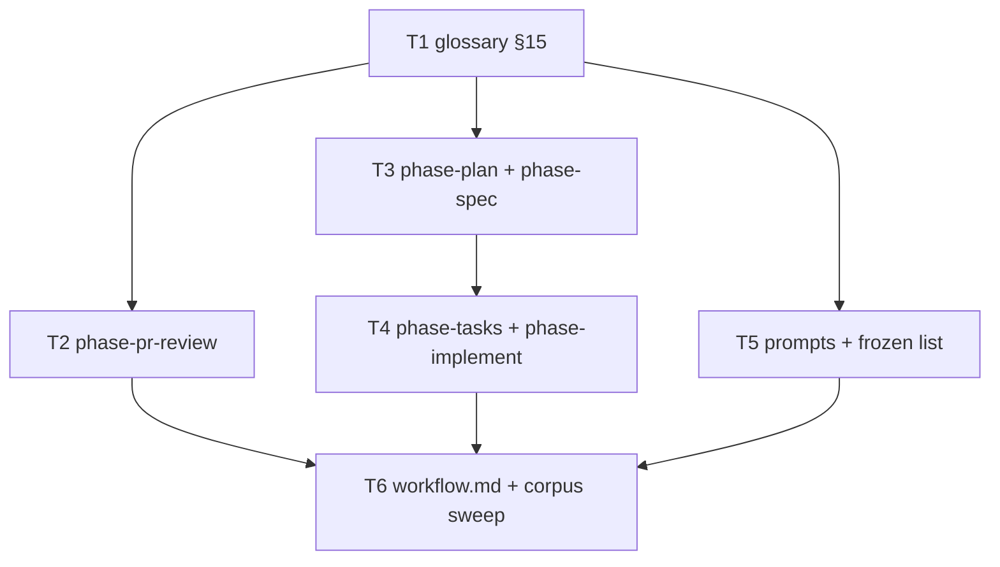

# Build plan: cross-gate iteration & disposition vocabulary (S5)

Upstream: `docs/specs/2026-07-26-iteration-disposition-vocabulary.md` rev4
(approved 2026-07-26, `d9825e1`) and
`docs/plans/2026-07-26-iteration-disposition-vocabulary.md` rev5.
Track: **irreversible**. Branch: `feat/iteration-disposition-vocabulary`.

All work is prose in `skills/sdlc/` plus one test file and one frozen-list edit.
No script, schema, or workflow changes (N1).

## Decomposition rationale

Tasks are **file-scoped, not contract-scoped**. C3 and C4 each span four phase
references, so a contract-per-task split would have two tasks editing the same
`§5`/`§6`/`§8` sections of the same files — a guaranteed conflict. Scoping by
file gives every task exclusive ownership of its surfaces.

Consequence, recorded as a derivation call: three scenarios (**IDV9**, **IDV10**,
**IDV26**) assert across *all four* phase references, so they cannot be owned by
the first task that touches one of them. They are owned by **T4**, the task that
completes the last reference each asserts over, and T3 → T4 is therefore
sequential rather than parallel. No scenario is co-owned by two tasks (PV1 Rule B
needs a single owner).

## Dependency graph

T2, T3 and T5 are parallelisable after T1 and share no surface. T6 is last
because it asserts across everything the others produce.

## Tasks

### T1 — Glossary section (C1)

- **Surfaces:** `skills/sdlc/references/system-reference.md` (append §15);
  new `test/iteration-disposition.test.js`.
- **Does:** the "Iteration & disposition" section — origin tags, dispositions
  (five values incl. `barred`), `defect class` + its `finding class` alias,
  reopen evidence bar, finding-record shape, id format with the closed prefix
  mapping, carry destinations, no-orphan rule with its four checkpoint kinds,
  ratified-decision collision, three amendment classes incl. C4(b)'s
  downstream-record-plus-marker rule. Terms only; ≤ 60 lines.
- **Scenarios owned:** IDV1, IDV2, IDV3, IDV25.
- **Checks:** `node --test test/iteration-disposition.test.js` (`scope: ["task"]`);
  `node --test test/*.test.js` (`scope: ["full"]`); `npx biome check .`.

### T2 — Panel run-shape (C2)

- **Surfaces:** `skills/sdlc/references/phase-pr-review.md` (§5 steps 2–5, one
  §1 clause); `test/iteration-disposition.test.js`.
- **Does:** every row of the C2 table, including the amendment of the existing
  "Only … escalate" sentence at `:205-207` and the alias sentence at the
  binds-forward paragraph `:209-217`. Both are *edits to existing sentences*,
  not additions beside them — IDV30/IDV31 are anchored precisely because an
  appended rule leaving the original standing is the failure mode.
- **Scenarios owned:** IDV5, IDV6, IDV7, IDV8, IDV13, IDV30, IDV31.
  (IDV18 is inspection, decided at the PR panel.)
- **Checks:** as T1.

### T3 — Plan and Spec references (C3, C4 — first half)

- **Surfaces:** `skills/sdlc/references/phase-plan.md`,
  `skills/sdlc/references/phase-spec.md`.
- **Does:** §5 amendment-class citations; §6 class-(a) pointers only; outbound
  `CARRY-TO-SPEC` (plan) and `CARRY-TO-BUILD` (spec) behind *under your
  configuration* callouts; inbound `CARRY-TO-SPEC` check blocking the Spec gate;
  glossary citations.
- **Scenarios owned:** IDV11.
- **Checks:** as T1.

### T4 — Tasks and Implement references (C3, C4 second half, C5)

- **Surfaces:** `skills/sdlc/references/phase-tasks.md`,
  `skills/sdlc/references/phase-implement.md`;
  `test/iteration-disposition.test.js`.
- **Does:** `phase-tasks.md` §4 spec-gap log (four columns, exact enums,
  explicit-"none", inbound-carry source) and §8 amendment citation + inbound
  `CARRY-TO-BUILD` check + outbound `CARRY-TO-IMPLEMENT`; `phase-implement.md`
  §4 carry landing beside the Assumptions appendix and §5 block with the
  `review.tasks: off` fallback; glossary citations.
- **Scenarios owned:** IDV9, IDV10, IDV12, IDV14, IDV26, IDV27, IDV29.
- **Checks:** as T1.

### T5 — Reviewer prompts and the frozen list (C6, C7)

- **Surfaces:** `skills/sdlc/prompts/adversary-{plan,spec,review}.prompt.md`;
  `test/frozen-surfaces.test.js`; `test/iteration-disposition.test.js`.
- **Does:** delta-round law in all three; `origin:` field in each STRICT output
  format; per-prompt carry-landing surfaces (plan: explicit *none*; spec:
  inbound; review: every carry minted in the run). Removes the three prompts
  from `FROZEN` and updates the header comment to name this slice and the
  post-merge re-freeze follow-up.
- **Coupling, deliberate:** the prompt edits and the `FROZEN` removal are one
  task because either alone leaves the corpus red.
- **Scenarios owned:** IDV15, IDV16, IDV19, IDV28.
- **Checks:** as T1.

### T6 — Consumer workflow.md and the corpus sweep (C8)

- **Surfaces:** `.pi/sdlc/workflow.md`; `test/iteration-disposition.test.js`.
- **Does:** deletes the four promoted rules, retains the other six verbatim.
  Adds the cross-cutting scenarios that can only run once T2/T4/T5 have landed.
- **Scenarios owned:** IDV4, IDV17, IDV23, IDV24, IDV32.
  (IDV20, IDV21, IDV22 are inspection / diff-inspection at the PR panel.)
- **Checks:** as T1, plus `node skills/sdlc/scripts/config-doc.mjs check`.

## Scenario ownership map

| Task | Scenarios |
|---|---|
| T1 | IDV1, IDV2, IDV3, IDV25 |
| T2 | IDV5, IDV6, IDV7, IDV8, IDV13, IDV30, IDV31 |
| T3 | IDV11 |
| T4 | IDV9, IDV10, IDV12, IDV14, IDV26, IDV27, IDV29 |
| T5 | IDV15, IDV16, IDV19, IDV28 |
| T6 | IDV4, IDV17, IDV23, IDV24, IDV32 |
| PR panel (inspection) | IDV18, IDV20, IDV21, IDV22 |

Every mechanical scenario has exactly one owning task.

## Spec gap log

Dogfooding C5 before it ships — this build plan carries the log its own slice
specifies.

| Description | Severity | Disposition | Landing site |
|---|---|---|---|
| The Spec fixes each contract's *placement* but not its exact wording; §5's scenarios assert distinctive phrases, so the implementer chooses phrasing that satisfies them. | minor | assumption-recorded | Assumptions appendix, below |
| IDV18/IDV20/IDV22 are inspection scenarios with no standing test; nothing in Implement can close them. | minor | `CARRY-TO-IMPLEMENT` | PR-panel review (recorded in this slice's PR consolidated artifact) |

No blocker-severity gaps. The Spec was reviewed over three waves and its
contracts are implementable as written.

## Assumptions

1. Exact prose wording is the implementer's, constrained by the scenarios'
   distinctive phrases.
2. One new test file (`test/iteration-disposition.test.js`) is added
   incrementally by T1, T2, T4, T5, T6 rather than one file per task — it keeps
   the corpus flat and matches the repo's existing one-file-per-concern habit.
   Consequence: tasks touch a shared test file, so they must not run
   concurrently *in the same worktree*; the sequencing above already serialises
   T6, and T2/T3/T5 append to disjoint sections.
3. `npm test` is the `"full"`-scoped check for every task; the single-file run is
   the `"task"`-scoped check (PV1 Rules A and B).
4. Full-corpus task validators must not be dispatched in parallel — a prior run
   flaked `check-references.test.js` (cwd-sensitive spawn) with three concurrent
   `npm test` invocations. Validators run serially.

## Tracker

`shape.publishToTracker` is 2 and this breakdown has 6 tasks, so it publishes:
one epic plus six sub-issues on board 5, per `assets/tracker-ops.md`.
