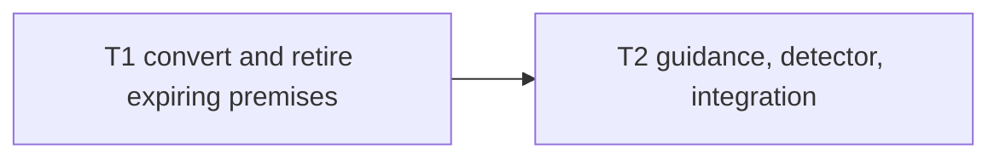

# Build plan: durable scenario premises and the standing diff guard

Upstream: `docs/specs/2026-08-06-diff-scoped-test-premises.md` rev 4
(approved 2026-08-06, `1beac53`) and
`docs/plans/2026-08-06-diff-scoped-test-premises.md` rev 4. Track:
**irreversible**. Branch: `fix/diff-scoped-test-premises`. Resolves #208.

## Decomposition rationale

Two tasks are sufficient and meet the configured tracker threshold. The split is
by test ownership:

- **T1** removes the expiring premises from the existing
  `iteration-disposition.test.js` corpus and owns all C5 scenarios.
- **T2** adds the new detector/law test and its documentation surfaces, then runs
  final integration over T1's cleaned corpus.

T1 blocks T2. The final guard's exact-equality assertion must not land first:
before T1, the executed detector correctly reports
`test/iteration-disposition.test.js` as a third hit, so T2's final two-key
exemption check would be red by design. The tasks otherwise share no writable
surface.

## Dependency graph

## Tasks

### T1 — Convert and retire the existing expiring premises

- **Surfaces:** `test/iteration-disposition.test.js` only.
- **Does:**
  - removes `node:child_process`, `baseRef`, and `baseFile`;
  - converts IDV3 to the exact current-tree §1-§14 literal-heading invariant,
    stripping the Markdown `##` prefix before comparison and proving mutation
    non-vacuity;
  - converts the diff-scoped IDV14 to the thin-router content invariant,
    stripping YAML front matter before checking for the forbidden Spec-gap table
    and proving mutation non-vacuity;
  - retires only the diff-scoped duplicate IDV15 and IDV16, leaving
    present-ownership comments that satisfy the code-comment law;
  - changes IDV17's subprocess inventory to the empty set, updates the file
    header, and makes the negative assertion non-vacuous through one fresh-regex
    projection function used for both the split-token sample and real source.
- **Scenarios owned:** DSP8, DSP9, DSP10, DSP11, DSP16.
- **Checks:**
  - `node --test test/iteration-disposition.test.js`
    (`tests`, `scope: ["task"]`);
  - `npm test` (`tests`, `scope: ["full"]`);
  - `npx biome check test/iteration-disposition.test.js` (`static`).
- **Definition of done:** all five owned scenarios pass; the file contains no
  executable child-process use or moving-ref helper; the task's PV1 manifest and
  runner+validator receipt pass.

### T2 — Add the durable-premise law, local policy, and mechanical guard

- **Blocked by:** T1.
- **Surfaces:**
  - `skills/sdlc/references/phase-spec.md` §4;
  - `skills/sdlc/references/phase-implement.md` §4;
  - `CONTRIBUTING.md`;
  - new `test/diff-scoped-premises.test.js`.
- **Does:**
  - adds C1's single normative law and C2's pointer without duplicating the law;
  - adds C3's contributor policy;
  - transposes Spec C4.2's executed prototype into the new test, recursively
    sweeping `.js`/`.mjs`/`.cjs`, with exact hit↔exemption key equality and the
    two reasoned exemptions;
  - implements DSP1-DSP7's law, sweep, mutation, self-match, and inventory
    scenarios in that file;
  - verifies the already-landed #192 handoff; and
  - runs final suite/config/frozen-surface checks.
- **Scenarios owned:** DSP1, DSP2, DSP3, DSP4, DSP5, DSP6, DSP7, DSP12, DSP13,
  DSP14, DSP15.
- **Checks:**
  - `node --test test/diff-scoped-premises.test.js`
    (`tests`, `scope: ["task"]`);
  - `npm test` (`tests`, `scope: ["full"]`);
  - `npx biome check test/diff-scoped-premises.test.js` (`static`);
  - `node skills/sdlc/scripts/config-doc.mjs check --repo-root . --format text`
    (`static`);
  - `node --test test/frozen-surfaces.test.js` (`tests`);
  - `/usr/bin/time -p node --test test/diff-scoped-premises.test.js`
    (`tests`; review-time N2 measurement, not an in-suite timing assertion);
  - `gh issue view 192 --repo threadsafe-systems/pi-sdlc --json comments --jq '.comments[].body' | grep -F 'DSP3'`
    (`static`; DSP14's durable handoff witness).
- **Definition of done:** all eleven owned scenarios pass; the detector reports
  exactly the two exempt files with non-empty reasons; measured test time is
  under one second; no frozen surface changed; the task's PV1 manifest and
  runner+validator receipt pass.

## Scenario ownership map

| Task | Scenarios |
| --- | --- |
| T1 | DSP8, DSP9, DSP10, DSP11, DSP16 |
| T2 | DSP1, DSP2, DSP3, DSP4, DSP5, DSP6, DSP7, DSP12, DSP13, DSP14, DSP15 |

Every scenario has exactly one owning task. T2 owns DSP15 because it runs after
T1 and is the integration frontier.

## Spec gap log

**None.** The approved Spec has no `CARRY-TO-BUILD`, and decomposition found no
upstream deficiency. The two tasks cover every scenario without inventing a
contract or leaving an implementation decision unowned.

## Assumptions

1. Spec C4.2's detector core is transposed exactly; test scaffolding may change,
   but the swept extensions, three pattern branches, exact-equality exemption
   semantics, and known exclusions do not.
2. The existing S1 comment is already landed at issue #192 comment 5202737602;
   T2 verifies rather than re-posts it.
3. `npm test` is the `"full"`-scoped test for both tasks; each task's named
   single-file command is its `"task"`-scoped test (PV1 Rules A and B).
4. Task validators run serially. Concurrent full-corpus validators previously
   exposed a cwd-sensitive `check-references.test.js` flake; parallel validation
   provides no value for a two-node sequential graph.
5. `npx biome check .` currently exits 0 with two warnings and one informational
   finding in historical prototype assets. Each task's touched JavaScript must
   be clean; this slice does not edit those assets.
6. Markdown surfaces are gated mechanically by DSP1, DSP2, and DSP13 rather than
   by a repository Markdown-lint script, because the package defines no such
   script.
7. There are no Build hooks configured. The phase therefore has no hook output
   to record.

## Tracker projection

`shape.publishToTracker` is 2 and this breakdown has exactly 2 tasks, so it
publishes one epic plus two native sub-issues on board 5. T2 is blocked by T1.
The committed build plan remains authoritative if tracker text drifts.
