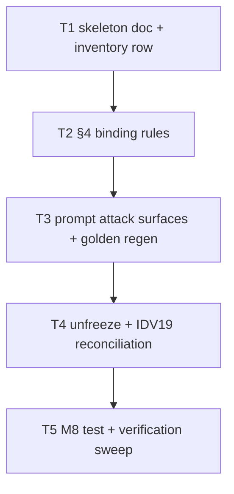

# Build plan: spec artifact skeleton (S1)

Upstream: `docs/specs/2026-08-08-spec-artifact-skeleton.md` rev 6 (approved
2026-08-08, spec panel closed by owner decision at commit chain
`3f596a0`…`9f14dce`) and `docs/plans/2026-08-08-spec-artifact-skeleton.md`
rev 4 (plan panel converged, 4 rounds). Track: **irreversible**.
Branch: `feat/spec-artifact-skeleton`.

All work is prose in `skills/sdlc/` (one new reference, one §4 edit, one prompt
edit), one inventory JSON row, two test-file edits (frozen list, IDV19
reconciliation), and one new contract-test file. No script or schema changes.

## Decomposition rationale

Tasks are **contract-scoped with one shared test file**. C1–C7 each own
disjoint production surfaces, so contract scoping works here (unlike S5, which
needed file scoping). The single C7 contract-test file
(`test/spec-artifact-skeleton.test.js`) is appended to incrementally — one new
file keeps the corpus flat and matches the repo's one-file-per-concern habit —
which serialises the tasks through a single writer.

Two merge decisions keep every task boundary **corpus-green**: the golden
fixture regeneration (SAS12's execution half) is folded into T3, the task whose
prompt edit breaks the golden; the IDV19 reconciliation is folded into T4, the
task whose unfreeze breaks IDV19.

Consequence, recorded as a derivation call: the shared test file makes the
chain strictly serial (T1→T2→T3→T4→T5). No scenario is co-owned by two tasks
(PV1 Rule B needs a single owner).

## Dependency graph

## Tasks

### T1 — Skeleton doc + inventory row (C1, C4)

- **Surfaces:** new `skills/sdlc/references/spec-artifact-skeleton.md`;
  `skills/sdlc/assets/normative-references.json`; new
  `test/spec-artifact-skeleton.test.js` (M1 + M5 assertions only).
- **Does:** authors the skeleton with the exact shape C1 pins — H1, five
  sections in the fixed set, the `<FILL_IN: …>` markers with their placeholder
  words, the numbered binding-rule sentences mirroring C2 1–4 verbatim — and
  the inventory row with exactly C4's nine fields, no `verification` key. Adds
  the M1 (skeleton shape) and M5 (inventory row) contract-test sections.
- **Scenarios owned:** SAS1, SAS5.
- **Checks:** `node --test test/spec-artifact-skeleton.test.js`
  (`scope: ["task"]`, offline, <1s); `npm test` (`scope: ["full"]`, offline,
  30s external timeout); `node skills/sdlc/scripts/check-references.mjs`.

### T2 — §4 binding rules (C2)

- **Surfaces:** `skills/sdlc/references/phase-spec.md` (§4 only); the contract
  test file (M2 assertions appended).
- **Does:** inserts the five-sentence paragraph (four numbered rules + the
  pointer) immediately after §4's first paragraph, exactly as C2 pins; adds
  the M2 assertions — adjacency, the numbered-list `1.`–`4.` markers, the
  three named existing paragraphs' beginnings, downstream order, and the
  "anything missing is a spec defect" sentence. SAS2's note applies: M2
  asserts beginnings/adjacency/order; full byte-intactness is SAS9's PR-gate
  diff-shape inspection.
- **Scenarios owned:** SAS2.
- **Checks:** `node --test test/spec-artifact-skeleton.test.js`
  (`scope: ["task"]`, offline, <1s); `npm test` (`scope: ["full"]`, offline,
  30s external timeout).

### T3 — Prompt attack surfaces + golden regen (C3)

- **Surfaces:** `skills/sdlc/prompts/adversary-spec.prompt.md` (surfaces B, C,
  D, F only); `test/fixtures/golden/spec_review.agent.md` (regenerated); the
  contract test file (M3 + M4 assertions appended).
- **Does:** weaves the component-name + skeleton-path references into the
  existing lettered attack surfaces — no new letter, no output-format change,
  Delta rounds section byte-stable (C3's invariants); regenerates the golden
  fixture (SAS12's execution half — the inspection half is the PR panel's);
  adds M3 (anchors + component names + path + byte-stable sections) and M4
  (negative: the four rule definitions absent from the prompt) assertions.
- **Scenarios owned:** SAS3.
- **Checks:** `node --test test/spec-artifact-skeleton.test.js`
  (`scope: ["task"]`, offline, <1s); `npm test` (`scope: ["full"]`, offline,
  30s external timeout); golden regeneration command (whatever the standing
  regen script is — implementer locates it from the golden-test source).

### T4 — Unfreeze + IDV19 reconciliation (C5, C6)

- **Surfaces:** `test/frozen-surfaces.test.js` (FROZEN list only);
  `test/iteration-disposition.test.js` (IDV19 loop only); the contract test
  file (M6 + M7 assertions appended).
- **Does:** removes the `adversary-spec.prompt.md` FROZEN entry leaving
  exactly L3's 16 entries in L3's order; reconciles IDV19 to exempt
  `adversary-spec.prompt.md` only, with the comment naming AM1, AM3 and the
  re-freeze obligation (C6's invariant); adds M6 (L3 equality with order) and
  M7 (IDV19 exemption shape) assertions.
- **Scenarios owned:** SAS6, SAS7.
- **Checks:** `node --test test/spec-artifact-skeleton.test.js`
  (`scope: ["task"]`, offline, <1s); `npm test` (`scope: ["full"]`, offline,
  30s external timeout).

### T5 — M8 test + verification sweep (C7 remainder)

- **Surfaces:** the contract test file (M8 assertions appended); no production
  surfaces.
- **Does:** adds the M8 assertions (no Cucumber/Behat/Gherkin vocabulary in the
  skeleton; positive rejection sentence present); runs the full verification
  sweep — the whole corpus, check-references, check-lifecycle at this run's
  declaration, biome over touched surfaces.
- **Scenarios owned:** SAS4, SAS8, SAS10, SAS11.
- **Checks:** `node --test test/spec-artifact-skeleton.test.js`
  (`scope: ["task"]`, offline, <1s); `npm test` (`scope: ["full"]`, offline,
  30s external timeout); `node skills/sdlc/scripts/check-references.mjs`;
  `bash skills/sdlc/scripts/check-lifecycle.sh --track irreversible --slug
  spec-artifact-skeleton`; `npx biome check` over touched surfaces.

## Scenario → task ownership

| Owner | Scenarios |
|---|---|
| T1 | SAS1, SAS5 |
| T2 | SAS2 |
| T3 | SAS3 |
| T4 | SAS6, SAS7 |
| T5 | SAS4, SAS8, SAS10, SAS11 |
| PR panel (inspection) | SAS9, SAS12, SAS13 |
| Carried — post-merge, orchestrator-owned | SAS14 |

Every mechanical scenario has exactly one owning task. SAS12's execution half
(golden regeneration) runs inside T3's checks; its inspection half — whether
the regenerated goldens' diff is confined to the new anchors — stays the PR
panel's, per the scenario's decision points. SAS14 is the mandatory
`track:none` re-freeze owned by the orchestrator after merge (spec AM3); the
obligation is recorded in the spec's Amendments and must appear in the PR
description.

## Spec gap log

None. The spec was reviewed over five rounds (34 findings, 34 incorporated,
0 dismissed) and its contracts are implementable as written; the two
mechanically-unverifiable claims (existing-paragraph byte-intactness, golden
diff confinement) are deliberately routed to PR-gate inspection by premise
durability, not gaps.

## Assumptions

1. One new test file (`test/spec-artifact-skeleton.test.js`) is appended to
   incrementally by T1–T5 rather than one file per task — corpus stays flat,
   one writer, serial chain.
2. Golden regeneration folds into T3 and IDV19 reconciliation into T4 so every
   task boundary leaves the corpus green.
3. `npm test` is the `"full"`-scoped check for every task; the single-file run
   is the `"task"`-scoped check (PV1 Rules A and B).
4. Full-corpus task validators must not be dispatched in parallel — a prior
   run flaked `check-references.test.js` (cwd-sensitive spawn) with three
   concurrent `npm test` invocations. Validators run serially.
5. **`npx biome check .` is red on the branch base** (two warnings + one info,
   all in `docs/briefs/assets/2026-07-23-orchestration-runtime-prototype/`,
   unrelated to this slice). Each task's PV1 `static` check is scoped to the
   surfaces that task touches; the base debt is left for its own `track:none`
   change (the #166 pattern). Verified at build time, 2026-08-08.
6. T5's `check-lifecycle.sh --track irreversible --slug spec-artifact-skeleton`
   passes through the declaration; later artifact stages (PR, merge)
   legitimately fail until those events exist — a later-stage failure is
   expected, not a task failure (SAS10's note).
7. Exact prose wording inside the skeleton's fill-in guidance is the
   implementer's, constrained by C1's pinned shape and the binding-rule
   sentences C2 quotes verbatim.

## Tracker

`shape.publishToTracker` is 2 and this breakdown has 5 tasks, so it publishes:
one epic plus five sub-issues on board 5, per `assets/tracker-ops.md`.

Published 2026-08-08: epic **#225**; tasks **#226** (T1), **#227** (T2),
**#228** (T3), **#229** (T4), **#230** (T5), serial blocked-by chain 227←226, 228←227, 229←228, 230←229
(each task blocked by its predecessor).
