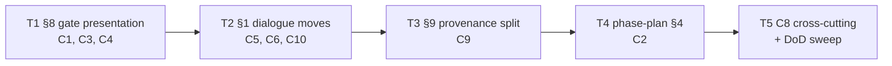

# Build plan: gate presentation contract (S3, map #192)

- Status: active
- Spec: docs/specs/2026-08-09-gate-presentation-contract.md (rev 4, 262d6dd)
- Plan: docs/plans/2026-08-09-gate-presentation-contract.md (rev 5, 1dd6211)
- Branch: feat/gate-presentation-contract
- Track: irreversible
- Slug: gate-presentation-contract

## Decomposition rationale

Nine contracts over three existing files plus one new test file, no frozen
surfaces touched (Assumption 2) and no new FS11 surface (Assumption 1), so the
natural unit is one task per governed surface: §8 of phase-brainstorm.md, §1
of phase-brainstorm.md, §9 of phase-brainstorm.md, §4 of phase-plan.md, and
the contract-test file that pins them. All contract tests live in ONE new
file (`test/gate-presentation-contract.test.js`, C8), created in T1 and
extended by each subsequent task — so the tasks form a serial chain sharing
that file, exactly the S1 precedent. The three PR-gate scenarios (GPC13,
GPC14, GPC15) are owned by the pr_review panel, not by a task.

## Dependency graph

## Tasks

### T1 — §8 gate presentation block (C1, C3, C4)

- **Surfaces:** `skills/sdlc/references/phase-brainstorm.md` (§8 only); new
  `test/gate-presentation-contract.test.js` (§8 assertions only).
- **Does:** rebuilds §8 as **The gate presentation** exactly as C1 pins —
  exactly two artifacts (sketch + decisions list), the sketch trigger and
  absence declaration, the three-kind line grammar with literal `appetite:` /
  `decision:` / `rejected:` prefixes (appetite exactly one and first, every
  entry one physical line), the amendment loop, the transition, and the
  three-criteria ADR bar preserved **by reference** to system-reference.md's
  Governance paragraph (never restated) with the conditional ASCII
  `(-> ADR 00NN)` suffix. Creates the contract test file and adds the §8
  assertions: block present with the anchor phrases, exactly-two-artifact
  wording, trigger/absence/amendment/transition named, grammar anchors,
  ADR-bar reference + suffix anchors. Tests assert anchors only, never
  restate rule substance (C8 invariant).
- **Scenarios owned:** GPC1, GPC5, GPC6, GPC17.
- **Checks:** `node --test test/gate-presentation-contract.test.js`
  (`scope: ["task"]`, offline, <1s); `npm test` (`scope: ["full"]`, offline,
  30s external timeout); `npx biome check` on touched files.
- **Pricing:** runner 30s external; validator one cheap model, ≤5 min wall.

### T2 — §1 dialogue moves (C5, C6, C10)

- **Surfaces:** `skills/sdlc/references/phase-brainstorm.md` (§1 only); the
  contract test file (§1 assertions appended).
- **Does:** names the dialogue moves in §1 per C10 — problem/outcome opening
  that names no mechanism, alternative-or-declare, appetite elicited before
  converging; folds G4 research-or-declare into the existing tools bullet per
  C5 keeping its proportionality sentence and naming the three triggers
  (external dependency, prior-art claim, cross-repo pattern) with the
  fired-but-skipped declaration requirement; adds the G7 single constraints
  prompt per C6 (constraints named or "none identified"; they bind the design
  only when they actually bind; Brainstorm never binds a constraint itself).
  Appends the §1 anchor assertions to the contract test file.
- **Scenarios owned:** GPC7, GPC8, GPC16.
- **Checks:** `node --test test/gate-presentation-contract.test.js`
  (`scope: ["task"]`, offline, <1s); `npm test` (`scope: ["full"]`, offline,
  30s external timeout); `npx biome check` on touched files.
- **Pricing:** runner 30s external; validator one cheap model, ≤5 min wall.

### T3 — §9 map-mode provenance split (C9)

- **Surfaces:** `skills/sdlc/references/phase-brainstorm.md` (§9 only); the
  contract test file (§9 assertions appended).
- **Does:** appends the provenance-split paragraph to §9 per C9 — the sketch
  embeds verbatim in the plan in both modes; only the decisions list becomes
  the index (named links, gist lines); the resolution comment is the single
  home of the full grammar; the thread variant (decisions ratified as map
  thread comments share one home; entries sharing a comment share one home).
  Appends the §9 anchor assertions. **Constraint:** the two skill-kernel
  anchors ("Working the map", "native GitHub sub-issues of the map",
  test/skill-kernel.test.js:52,55) stay intact — the edit appends a
  paragraph, never rewrites the pinned lines (plan Assumption 4).
- **Scenarios owned:** GPC3, GPC4, GPC18.
- **Checks:** `node --test test/gate-presentation-contract.test.js`
  (`scope: ["task"]`, offline, <1s); `npm test` (`scope: ["full"]`, offline,
  30s external timeout — covers the skill-kernel anchor test);
  `npx biome check` on touched files.
- **Pricing:** runner 30s external; validator one cheap model, ≤5 min wall.

### T4 — phase-plan.md §4 storage rule (C2)

- **Surfaces:** `skills/sdlc/references/phase-plan.md` (§4 only); the
  contract test file (§4 assertions appended).
- **Does:** extends §4's first-paragraph section enumeration with the
  Brainstorm provenance block and inserts the storage rule between the first
  paragraph and **Dialogue discipline.** per C2 — Plans entered from
  Brainstorm open with the provenance block (store in plain mode, index in
  map mode), standalone Plans declare "no upstream gate", and a plan must not
  contradict a named decision or resurrect a `rejected:` line without a
  declared deviation (enforcement routes by reference to the frozen
  adversary-plan prompt's attack surface D — the prompt stays untouched).
  Single paragraph insertion (plan Assumption 3). Appends the §4 assertions:
  enumeration extended, rule placement, both branches named, no-contradiction
  clause present.
- **Scenarios owned:** GPC2.
- **Checks:** `node --test test/gate-presentation-contract.test.js`
  (`scope: ["task"]`, offline, <1s); `npm test` (`scope: ["full"]`, offline,
  30s external timeout); `npx biome check` on touched files.
- **Pricing:** runner 30s external; validator one cheap model, ≤5 min wall.

### T5 — C8 cross-cutting assertions + DoD sweep

- **Surfaces:** the contract test file (cross-cutting assertions appended);
  no doc surfaces.
- **Does:** appends C8's cross-cutting assertions — no new dial (config
  schema + this repo's config byte-identical to main), no new files under
  `lib/`, `bin/`, `src/`, or `skills/sdlc/scripts/`, the test file imports
  only node built-ins and `node:test` (the no-parser prohibition), the
  no-restatement bound (no ≥80-character verbatim substring of any governed
  doc embedded in the test file), and the consumer-fixture diff guard
  (`git diff main...HEAD -- test/fixtures/consumer/` empty). Then runs the
  full DoD sweep: full corpus green (30s external), biome clean on the
  touched set, check-references exit 0, check-lifecycle exit 0 with
  `--track irreversible --slug gate-presentation-contract` (expected to reach
  artifact.build once this plan is committed), frozen surfaces via ASD19.
- **Scenarios owned:** GPC10, GPC11, GPC12.
- **Checks:** `node --test test/gate-presentation-contract.test.js`
  (`scope: ["task"]`, offline, <1s); `npm test` (`scope: ["full"]`, offline,
  30s external timeout); `node skills/sdlc/scripts/check-references.mjs`;
  `bash skills/sdlc/scripts/check-lifecycle.sh --track irreversible --slug
  gate-presentation-contract`; `npx biome check` on touched files.
- **Pricing:** runner 30s external; validator one cheap model, ≤5 min wall.

## Scenario → task ownership

| Scenario | Kind | Owner |
|---|---|---|
| GPC1, GPC5, GPC6, GPC17 | mechanical | T1 |
| GPC7, GPC8, GPC16 | mechanical | T2 |
| GPC3, GPC4, GPC18 | mechanical | T3 |
| GPC2 | mechanical | T4 |
| GPC10, GPC11, GPC12 | mechanical | T5 |
| GPC13, GPC14 | inspection | PR gate (pr_review panel) |
| GPC15 | carried | PR gate (pr_review panel) |

14 mechanical / 2 inspection / 1 carried = 82% mechanical.

## Spec gap log

| Description | Severity | Disposition | Landing site |
|---|---|---|---|
| none | — | — | — |

## Assumptions

1. No unfreeze/re-freeze cycle: phase-brainstorm.md and phase-plan.md are not
   in the FROZEN list (plan Assumption 2, verified at plan time).
2. No normative-references.json row: no new `references/*.md` file is created
   (plan Assumption 1; the spec's own check-references gate GPC12 covers it).
3. `npx biome check` on main is red for pre-existing findings under
   docs/briefs/assets/ (S1 precedent, assumption 5 there): lint evidence is
   scoped to the files this slice touches.
4. The full-corpus `npm test` is run serially, never as parallel
   task-validators (S1 gotcha: concurrent runs flake check-references).
5. Validator models rotate through the owner's maas-qwen pool
   (deepseek-v4-flash-0731, qwen3.7-plus, glm-5.2, qwen3.8-max) for continued
   endpoint validation, one model per task.

## Tracker

publishToTracker=2 — this five-task breakdown publishes as one epic + five
native sub-issues on board 5, wired T1→T5 with blocked-by edges. The tracker
is a projection of this committed document; this document is the source of
truth.

Projection (published 2026-08-09, board 5):

- Epic #234 — Epic: S3 gate presentation contract (map #192)
- #235 T1 — §8 gate presentation block (C1, C3, C4)
- #236 T2 — §1 dialogue moves (C5, C6, C10), blocked by #235
- #237 T3 — §9 map-mode provenance split (C9), blocked by #236
- #238 T4 — phase-plan.md §4 storage rule (C2), blocked by #237
- #239 T5 — C8 cross-cutting assertions + DoD sweep, blocked by #238
