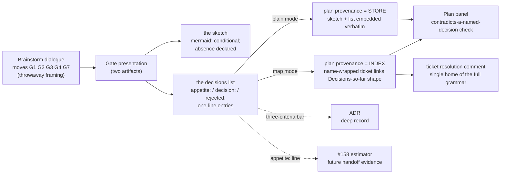

# Plan: S3 brainstorm gate-presentation contract (map #192)

Status: rev 3, plan panel round 2 all-incorporated (R2-D1..D3; R1-01..11
re-verified CLEAR, see docs/reviews/plan-review-gate-presentation-contract-2026-08-09/).
Run slug `gate-presentation-contract`,
track irreversible. Map #192 slate row S3; bundles R1-G1, G2, G3, G4, G5, G7,
G8 with R1-G5's shape amended at this gate (see provenance `rejected:` lines).

## Brainstorm provenance

Ratified at the brainstorm gate 2026-08-09 (approver `human:neilwashere`),
map mode — this block is the index; the full grammar lives exactly once in
the resolution comment linked below (R2-D1). Design re-assessed Matt
Pocock's wayfinder + domain-modeling discipline: the whiteboard is framing
and throwaway; only the crystallised residue persists.

### The sketch

### The decisions list (index — map mode)

This run is map-sourced (Map #192 slate row), so this block is the index;
every entry links the single home of the full grammar, the resolution
comment [S3 gate record][s3-gate-record]. The sketch above embeds verbatim
as a gate artifact in both modes.

- [appetite: one lifecycle slice (brainstorm→PR), S1-comparable scale, track irreversible; human gate + panel gates per config][s3-gate-record]
- [gate presentation = exactly two artifacts (sketch + decisions list); R1-G5 prose skeleton dissolved; G1/G2/G3/G4/G7 survive as dialogue moves][s3-gate-record]
- [sketch trigger = new flow or ≥3 interacting components; absence declared at the gate; embeds verbatim in the plan in both modes][s3-gate-record]
- [grammar = three line kinds (appetite exactly-one-first, decision, rejected); one-line entries; ASCII (-> ADR 00NN) suffix][s3-gate-record]
- [rejections always crystallise — a refused alternative is an explicit not-do decision with trade-off rationale][s3-gate-record]
- [ADR bar = system-reference.md's Governance paragraph, preserved by reference; qualifying decisions take the suffix][s3-gate-record]
- [plain mode — the plan is the store: sketch + decisions list embedded verbatim][s3-gate-record]
- [map mode — the sketch still embeds; only the list becomes the index; full grammar once in the resolution comment (thread variant)][s3-gate-record]
- [assumptions cross in the plan's own Assumptions section, not recap material][s3-gate-record]
- [enforcement = S1 pattern only — contract tests on rule prose; substance rides the human gate; no parser, no dial, no panel][s3-gate-record]
- [rejected: verbatim prose recap block — framing is throwaway; supersedes R1-G5's slate wording][s3-gate-record]
- [rejected: gate-time mechanical grammar parser — the human gate suffices for a framing phase][s3-gate-record]
- [rejected: discarding rejected alternatives below the ADR bar — owner amendment; rejections are first-class crystallisation][s3-gate-record]

[s3-gate-record]: https://github.com/threadsafe-systems/pi-sdlc/issues/192#issuecomment-5230679564

## Problem statement

Brainstorm's exit is shapeless today: §8 names the completion evidence "the
human-approved design" with no structure, so (a) the Plan panel cannot
distinguish what the human ratified from what the plan author invented,
(b) refused alternatives evaporate the moment the session ends, and (c) in
map mode any recap would restate what tickets already hold, breaking the
one-place law. R1's answer — an eight-item prose skeleton restated verbatim
in the plan — over-contractualised a framing phase; the wayfinder and
domain-modeling re-assessment shows the correct split: framing is throwaway,
only decisions and language persist.

## Objective

Every brainstorm exits through a two-artifact gate presentation (sketch +
decisions list) whose residue lands in the plan's provenance — embedded
verbatim in plain mode, indexed by name in map mode — so downstream panels
can catch a plan contradicting a named decision or resurrecting a rejected
alternative.

## In scope

1. `skills/sdlc/references/phase-brainstorm.md` §8 rebuilt as **The gate
   presentation**: the two-artifact requirement, the three-kind grammar, the
   sketch trigger + absence declaration, the amendment loop (human speaks,
   agent updates, amended list lands), the transition (the plan carries
   the provenance), and the three-criteria ADR bar preserved **by reference**
   to system-reference.md's Governance paragraph (never restated in §8,
   including this plan — R2-D2) as an additional deep record for both modes.
2. `skills/sdlc/references/phase-brainstorm.md` §1: the named dialogue moves
   — problem/outcome opening that names no mechanism (G1),
   alternative-or-declare (G2), appetite elicited before converging (G3),
   research-or-declare (G4), and one constraints prompt (G7). G4 folds into
   the existing tools bullet keeping its proportionality: the
   proportional/not-mandatory-ceremony sentence stays; named triggers
   (external dependency, prior-art claim, cross-repo pattern invoked) make
   research-or-declare required only when a trigger fires; outside triggers
   there is no research ceremony, and a fired-but-skipped trigger must be
   declared. G7 is one prompt asking the human to name the constraints that
   shape the design, or declare "none identified"; named constraints inform
   the design and become decision lines only when they actually bind —
   Brainstorm never binds a constraint itself.
3. `skills/sdlc/references/phase-brainstorm.md` §9: the map-mode provenance
   split — the sketch embeds verbatim in the plan in both modes (a gate
   artifact, belonging to no ticket); only the decisions list becomes the
   index (named links, gist lines); the resolution comment is the single
   home of the full grammar (the three line kinds) — a decision ticket's
   resolution comment or, thread variant (R2-D1), a comment in the map
   thread when decisions are ratified there rather than in separate tickets
   (entries sharing a comment share one home; this run's own gate record is
   such a comment).
4. `skills/sdlc/references/phase-plan.md` §4: the provenance rule, doc-side
   only. The first paragraph's section enumeration gains the Brainstorm
   provenance block. Plans **entered from Brainstorm** open with the
   provenance block (the gate sketch when one exists, then the decisions
   list: store in plain mode, index in map mode); **standalone Plans**
   (`sdlc:plan`, no committed upstream) record the live-formed intent in the
   same position with an explicit "no upstream gate" declaration. A plan must
   not contradict a named decision or resurrect a `rejected:` line without a
   declared deviation; enforcement rides the plan panel's existing attack
   surface D (locked decisions) in `prompts/adversary-plan.prompt.md` — by
   reference, never restated, and the prompt stays untouched (it is frozen).
5. `test/gate-presentation-contract.test.js`: contract tests (offline string
   assertions, S1 pattern) covering the semantic directions: appetite
   exactly-one-first; one-line entries; the ASCII `(-> ADR 00NN)` suffix;
   sketch trigger + absence declaration; the store/index split and the
   sketch-in-both-modes rule; the standalone exception; the ADR-bar
   reference; the G4 trigger rules (research-or-declare required only when a
   named trigger fires; a fired-but-skipped trigger must be declared) and
   the G7 rules (constraints named or "none identified"; they bind the
   design only when they actually bind); the no-parser prohibition. Literal anchor definitions land in
   the Spec phase (separateSpec=true).

## Out of scope

- Editing `prompts/adversary-plan.prompt.md` (frozen; enforcement routes to
   its existing attack surface D by reference — no unfreeze dance in S3).

- S2 (plan skeleton template embedding the provenance placeholder) — it
  consumes this seam; S3 defines the rule, S2 builds the skeleton.
- Map DAG rendering / sdlc-visual-docs — S7 territory, advisory-only.
- Mechanical appetite reading — #158's estimator consumes the line later.
- Review-dial changes (#159 no-dials law), adversary prompts (no brainstorm
  adversary exists), router templates (stay thin), tracker mechanics (owned
  by §9 + assets/tracker-ops.md).

## Definition of done

1. §8 rebuilt and §1 moves present — incl. the G4 trigger/skip and the G7
   none/binding semantics (R2-D3); contract tests assert the anchors.
2. phase-plan.md §4: first-paragraph enumeration extended with the
   provenance block, and the rule placed between the first paragraph and
   **Dialogue discipline.**; contract tests assert both.
3. Contract test file runs offline, < 1 second:
   `node --test test/gate-presentation-contract.test.js`.
4. Full corpus `npm test` green, external budget 30 seconds.
5. `npx biome check` clean on the touched-file set (the two phase references
   - the new test file).
6. `node skills/sdlc/scripts/check-references.mjs` exit 0 — no new FS11
   surface (rules live in existing references; no inventory row needed).
7. `bash skills/sdlc/scripts/check-lifecycle.sh --track irreversible --slug
   gate-presentation-contract` exit 0 once Spec AND Build artifacts are
   committed; mid-run artifact.spec/artifact.build failures are expected
   (S1 precedent).
8. Frozen surfaces byte-identical (ASD19 via full corpus);
   `git diff main...HEAD -- test/fixtures/consumer/` empty; the two
   skill-kernel §9 anchors ("Working the map", "native GitHub sub-issues of
   the map") intact via full corpus.

## Assumptions

1. No new `references/*.md` file → no normative-references.json row (FS11
   discovery/inverse-completeness unaffected).
2. phase-brainstorm.md and phase-plan.md are not in the FROZEN list
   (verified: 16 entries, no phase references) — no unfreeze/re-freeze dance.
3. test/diff-scoped-premises.test.js DSP1 is scoped to phase-spec.md §4 only
   (verified); phase-plan.md §4 insertions carry no DSP-class constraint,
   but keep the insertion a single paragraph to stay proportionate.
4. skill-kernel.test.js pins two §9 lines; the §9 addition appends a
   paragraph without touching them.

## Context for the next agent

The provenance block above is itself the dogfood artifact: it is exactly the
contract this slice writes into the phase references. If the panel changes
the contract, update the provenance block and the rule prose together.
`--author` identity: the orchestrating session's live model at dispatch
time (check the session jsonl, do not assume authorDefault). Branch:
`feat/gate-presentation-contract`.
