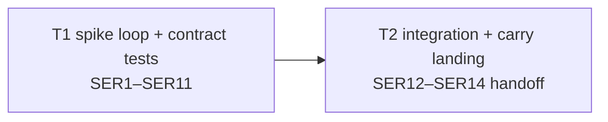

# Build plan: S4 spike exit rule (map #192)

- Status: active
- Spec: `docs/specs/2026-08-09-spike-exit-rule.md` (rev 5, `38e6968`)
- Plan: `docs/plans/2026-08-09-spike-exit-rule.md` (rev 4, `e16f3db`)
- Branch: `feat/spike-exit-rule`
- Track: irreversible
- Slug: `spike-exit-rule`

## Decomposition rationale

The implementation has one indivisible contract seam: the `### Spike exit loop`
prose and the assertions that make its routing/checkpoint/outcome vocabulary
falsifiable. Splitting prose from tests would make the first task unvalidatable,
so T1 owns both touched source surfaces and SER1–SER11. T2 owns the bounded
integration sweep, creates the already-ratified ephemeral-evidence follow-up,
and prepares SER12–SER14's PR handoff. The serial two-task shape reaches the
configured tracker threshold without inventing parallel work or a third source
surface.

## Dependency graph

## Tasks

### T1 — Spike exit loop and contract tests

- **Objective:** implement C1–C5 as one coherent §8 change.
- **Surfaces:** `skills/sdlc/references/phase-brainstorm.md` §8;
  `test/gate-presentation-contract.test.js`.
- **Does:** adds one literal `### Spike exit loop` block before the existing
  conditional Plan transition; encodes the first-match read → Plan/front-load →
  human-judgment → spike routing; names #147 only as future read-tier
  mechanisation; requires the pre-spike and continuation checkpoints; separates
  direction from artifact treatment; pins adequate-criteria exit semantics;
  records retained spike evidence through a self-contained existing `decision:`
  line; preserves exactly two gate artifacts, one §8 mermaid fence, and the
  literal Plan-transition anchor. Appends one structural block helper, exact-set
  phase/router discovery, and anchor/order assertions to the existing test file
  under GPC10's anti-restatement guard.
- **Scenarios owned:** SER1–SER11.
- **Checks:** `node --test test/gate-presentation-contract.test.js`
  (`scope: ["task"]`, offline, <1s); `npm test` (`scope: ["full"]`, serial,
  30s external timeout); `npx biome check
  test/gate-presentation-contract.test.js` (5s); `node
  skills/sdlc/scripts/check-references.mjs` (5s).
- **Definition of Done:** C1–C5 and SER1–SER11 are implemented; focused and full
  checks pass within budget; no surface outside the two named files changes;
  Code-prose pass: complete; PV1 task manifest, deterministic runner receipt,
  and independent validator receipt pass before closure.
- **Pricing:** runner ≤30s external; one task-validator model, ≤5 minutes wall.

### T2 — Integration sweep and PR carry preparation

- **Objective:** prove the complete slice and prepare the two PR-gate scenarios
  without adding implementation machinery.
- **Surfaces:** no feature source; this build plan's tracker/follow-up records,
  the task-validation manifest/receipt, and the future PR consolidated record.
- **Does:** files the durable ephemeral spike-evidence lifecycle issue with both
  outcomes (promote, or delete and repair temporary Plan/Spec pointers), records
  its URL, host-action start/finish times, and zero incremental model calls for
  SER14; verifies current-tree exact sets and the final full corpus; runs
  lifecycle/reference/lint checks; hands SER13's required reviewed-head,
  changed-file inventory, panel-output availability, adjudication timing, and
  incremental-call fields to PR review.
- **Scenarios owned:** SER12. SER13 remains an inspection at `pr_review`; SER14
  remains carried to `pr_review`, with its issue created here and its committed
  landing record completed there.
- **Checks:** `node --test test/gate-presentation-contract.test.js`
  (`scope: ["task"]`, offline, <1s); `npm test` (`scope: ["full"]`, serial,
  30s external timeout); `npx biome check
  test/gate-presentation-contract.test.js` (5s); `node
  skills/sdlc/scripts/check-references.mjs` (5s); `bash
  skills/sdlc/scripts/check-lifecycle.sh --track irreversible --slug
  spike-exit-rule` (5s).
- **Definition of Done:** SER12 passes; the follow-up issue exists and both
  required policy outcomes are present; the PR handoff names every durable
  SER13/SER14 evidence field; no parser/config/schema/telemetry/storage hierarchy
  or reuse mandate was added; Code-prose pass: complete; PV1 task manifest,
  deterministic runner receipt, and independent validator receipt pass before
  closure.
- **Pricing:** runner ≤30s external; issue host action ≤5 minutes and zero model
  calls; one task-validator model, ≤5 minutes wall.

## Scenario → task ownership

| Scenario | Kind | Owner |
|---|---|---|
| SER1–SER11 | mechanical | T1 |
| SER12 | mechanical | T2 |
| SER13 | inspection | PR gate (`pr_review` panel) |
| SER14 | carried | PR gate (`pr_review` consolidated record); issue prepared by T2 |

12 mechanical / 1 inspection / 1 carried = 86% mechanical.

## Spec gap log

| Description | Severity | Disposition | Landing site |
|---|---|---|---|
| none | — | — | — |

No inbound `CARRY-TO-BUILD` was minted at the Spec gate.

## Carry ledger

| Carry | Destination | Landing site | Status |
|---|---|---|---|
| SER14 ephemeral-evidence follow-up | `pr_review` | committed PR consolidated record: issue URL, host-action timestamps, incremental model-call count | issue #245 created; PR landing pending |

## Assumptions

1. `phase-brainstorm.md` and `test/gate-presentation-contract.test.js` are not in
   ASD19's FROZEN list; no unfreeze/re-freeze window is needed.
2. The current tree contains exactly six `references/phase-*.md` files and six
   `templates/sdlc-*.md` routers; T1 turns that observed premise into a durable
   current-tree exact-set assertion.
3. Full-corpus `npm test` runs serially, never concurrently with another
   task-validator, because this repo has a known cwd-sensitive reference-check
   flake under parallel full-suite runs.
4. Biome ignores Markdown; its gate is scoped honestly to the touched JavaScript
   test file. Markdown receives `git diff --check`, reference checking, and panel
   inspection rather than a false Biome claim.
5. GPC10 checks the complete test source against governed prose; new regexes and
   labels remain short anchor assertions, never copied rule paragraphs.
6. SER14's issue creation is a deterministic host action requiring no model call;
   its timing and call-count evidence is copied into the PR consolidated record.

## SER14 host-action evidence

| Field | Value |
|---|---|
| Issue | [#245 — Grill: ephemeral spike evidence lifecycle](https://github.com/threadsafe-systems/pi-sdlc/issues/245) |
| Started | `2026-08-09T19:45:57Z` |
| Finished | `2026-08-09T19:45:58Z` |
| Incremental model calls | `0` |

The 1-second host action is within SER14's 5-minute budget. The issue body keeps
both required outcomes: promote retained material, or delete it and repair every
temporary Plan/Spec pointer.

## PR review handoff

The PR orchestrator completes this table in the committed consolidated review;
T2 has prepared every field and the durable SER14 values rather than estimating
review-time evidence early.

| Scenario | Required field | PR-review source |
|---|---|---|
| SER13 | immutable reviewed head SHA | `git rev-parse HEAD` immediately before panel dispatch |
| SER13 | exact changed-file inventory | `git diff --name-only <base>...<reviewed-head>` at that SHA |
| SER13 | reviewer verdicts and consolidated verdict | harvested configured PR-panel outputs and adjudication |
| SER13 | panel-output availability time | latest terminal timestamp across the configured panel wave |
| SER13 | adjudication start and finish times | orchestrator timestamps around consolidation |
| SER13 | incremental model-call count | `0` beyond the configured PR panel; no extra SER13 reviewer |
| SER14 | durable issue | [#245](https://github.com/threadsafe-systems/pi-sdlc/issues/245) |
| SER14 | host-action start and finish times | `2026-08-09T19:45:57Z` / `2026-08-09T19:45:58Z` |
| SER14 | incremental model-call count | `0` for issue creation |

The PR gate does not pass until its consolidated record carries every row above,
links #245, and lands the carry ledger entry. The inspection allows at most one
checklist row per configured reviewer and five minutes of adjudication after all
panel outputs are available.

## Tracker

`shape.publishToTracker=2`, so this two-task breakdown publishes as one epic plus
two native sub-issues on board 5. T2 is blocked by T1. The tracker is a
projection of this committed document; this document remains authoritative.

Projection (published 2026-08-09, board 5):

- Epic [#242](https://github.com/threadsafe-systems/pi-sdlc/issues/242) — S4 spike exit rule (map #192)
- [#243](https://github.com/threadsafe-systems/pi-sdlc/issues/243) — T1 spike exit loop and contract tests
- [#244](https://github.com/threadsafe-systems/pi-sdlc/issues/244) — T2 integration sweep and PR carry preparation, blocked by #243
- Follow-up [#245](https://github.com/threadsafe-systems/pi-sdlc/issues/245) — ephemeral spike evidence lifecycle (separate from epic tasks)
