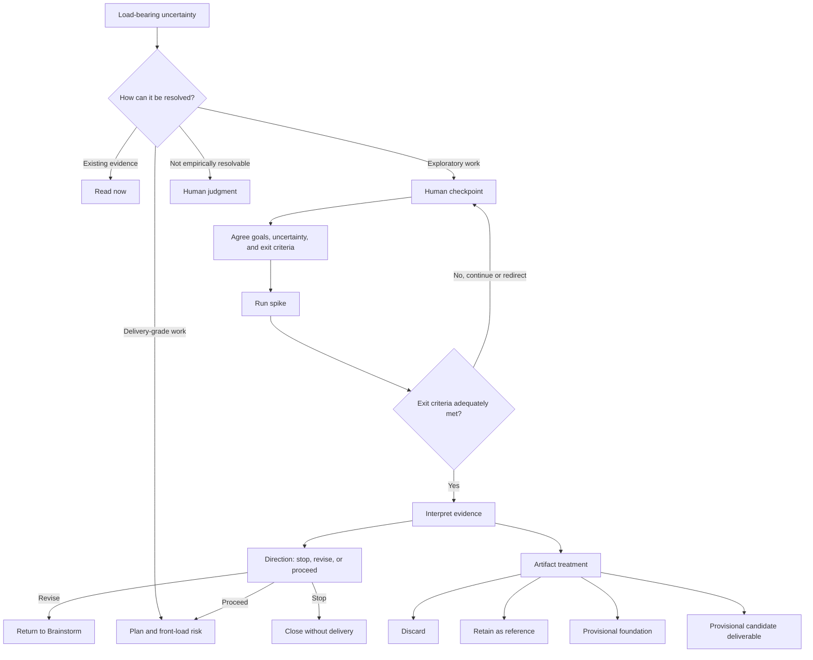

# Plan: S4 spike exit rule (map #192)

Status: rev 2, incorporating all plan-panel round-1 findings. Run slug
`spike-exit-rule`, track irreversible. Map #192 slate row S4; carries R1-G6
with the original throwaway/timebox proposal amended by the owner-ratified
Brainstorm design.

## Brainstorm provenance

Ratified at the plain-mode Brainstorm gate on 2026-08-09 (approver
`human:neil`). This Plan is the store: the sketch and decisions list below are
embedded verbatim from the gate presentation.

### The sketch

### The decisions list

- appetite: one S3-comparable irreversible lifecycle slice, limited to Brainstorm guidance and contract tests; no telemetry or tooling implementation
- decision: a spike is a bounded-by-exit-criteria information-buying activity inside Brainstorm, not a seventh lifecycle phase — preserves the six-phase topology while allowing exploration before Plan
- decision: spike routing asks how a load-bearing uncertainty can be resolved — read existing evidence now, spike exploratory work, Plan and front-load delivery-grade work, or use human judgment when evidence cannot decide
- decision: starting a spike requires a human checkpoint approving its explicit goal or goals, the uncertainty addressed, and exit criteria — prevents silent open-ended implementation under an exploratory label
- decision: S4 imposes no numerical time or cost threshold — usage evidence must mature before any such constraint is frozen
- decision: exit criteria that require detailed solution requirements or delivery acceptance criteria indicate a deliverable in disguise and route toward Plan — keeps the spike at exploratory altitude
- decision: inadequate evidence or newly revealed uncertainty requires a fresh human checkpoint with amended goals and exit criteria before the spike continues — makes scope growth visible
- decision: spike evidence determines direction independently from artifact treatment — direction is stop, revise, or proceed; treatment is discard, reference, provisional foundation, or provisional candidate deliverable
- decision: discard and reference may be final treatments at Brainstorm exit, while foundation and candidate-deliverable status are human-ratified but provisional until downstream contracts are satisfied — useful work remains eligible for reuse without mandating it
- decision: retained material may live in any suitable durable form and is linked from an existing `decision:` line — heterogeneous outputs do not justify a mandatory spike directory
- decision: every spike decision line summarizes what was learned independently of its evidence link — later artifact removal cannot erase the durable decision
- decision: the initial learning corpus is qualitative decision lines plus linked evidence — telemetry vocabulary is deferred until actual usage stabilizes the concepts
- decision: #147 remains the separate future mechanisation of the read tier — S4 endorses but does not implement its feasibility linter
- decision: R1’s existing XP-spike and local prototype research is sufficient grounding for this slice — no new prior-art pass is required
- decision: ephemeral spike evidence lifecycle is parked to a follow-up — before merge, temporary evidence must eventually be promoted or removed with every temporary Plan/Spec pointer repaired
- rejected: mandatory throwaway treatment for every spike — exploration can produce useful reference material, a foundation, or a candidate deliverable
- rejected: reserving spike for disposable experiments while introducing sibling prototype and pilot mechanisms — one evidence-buying concept with explicit goals and post-evidence treatment avoids overlapping vocabulary
- rejected: predicting artifact treatment before running the spike — the evidence itself determines which treatments are credible
- rejected: mandatory reuse when an artifact is eligible as a foundation — eligibility preserves optionality rather than creating sunk-cost pressure
- rejected: a fixed time or cost limit in the first release — the project lacks evidence for a defensible threshold
- rejected: new spike telemetry events or a mandatory `docs/spikes/` hierarchy — both freeze premature structure outside this slice’s appetite

## Problem statement

Brainstorm currently has only one successful transition: approve the design and
proceed to Plan. A load-bearing uncertainty that reading cannot settle therefore
forces either premature Plan ceremony or ad hoc experimentation with no declared
goal, exit criteria, continuation checkpoint, or durable interpretation. R1-G6
identified the missing information-buying path, but its proposed universal
half-day timebox and mandatory throwaway treatment collapse distinct exploratory
uses into one narrow form and are not supported by this project's evidence.

## Objective

Brainstorm can deliberately route a load-bearing uncertainty to a human-approved
spike, interpret the resulting evidence without conflating delivery direction
with artifact treatment, and then stop, revise, or proceed without adding a
lifecycle phase or bypassing downstream contracts.

## In scope

1. `skills/sdlc/references/phase-brainstorm.md` §8: a distinct titled
   spike-routing block after the existing gate-presentation grammar. This is a
   non-amending addition beside GPC C1: it preserves exactly two gate artifacts,
   the three line kinds, the amendment loop, and Plan provenance. §8 owns the
   rule because it changes Brainstorm completion/transition; §1's G4 remains a
   dialogue move, not an exit.
2. The four-way guide applies to each load-bearing uncertainty using explicit
   predicates: evidence already present in repo/config/docs/web routes to
   **read**; exploratory activity with declared exit criteria that can reduce
   uncertainty before delivery specification routes to **spike**; criteria that
   require detailed requirements, delivery acceptance, or production behaviour
   route to **Plan and front-load**; questions no empirical evidence can settle
   route to **human judgment**. This is deterministic prose guidance, not a
   third gate artifact, parser, or numeric threshold.
3. The pre-spike human checkpoint: explicit goal or goals, the uncertainty each
   addresses, and exit criteria. No numeric time/cost threshold. Exit criteria
   that need detailed requirements or delivery acceptance criteria trigger the
   deliverable-in-disguise warning and route toward Plan.
4. The continuation rule: inadequately met criteria or new uncertainty requires
   a fresh human checkpoint with amended goals and criteria; the agent never
   silently extends the spike.
5. The post-spike interpretation: direction (`stop` | `revise` | `proceed`) is
   independent from artifact treatment (`discard` | `reference` | provisional
   `foundation` | provisional `candidate deliverable`). All combinations are
   legal when the decision line names what future or proceeding effort any
   foundation/candidate serves; otherwise that provisional treatment is reduced
   to reference or discard. Foundation/deliverable status permits consideration,
   never mandates reuse, and remains provisional until downstream contracts are
   satisfied.
6. Evidence durability: retained material may use any suitable durable form and
   is linked from an existing `decision:` line; the line itself summarizes the
   learning so the durable decision does not depend on the link remaining live.
   The initial corpus is qualitative only.
7. Exit topology: spike is a Brainstorm activity/checkpoint loop, not a seventh
   phase or third gate artifact. A `stop` direction closes the proposed change;
   `revise` returns to Brainstorm; `proceed` transitions normally to Plan.
8. `test/gate-presentation-contract.test.js`: append offline contract tests over
   the distinct spike block. The existing GPC tests continue to own the
   gate-presentation block; S4 assertions own only spike-routing anchors and stay
   under GPC10's anti-restatement guard. No parser or long canonical sentence is
   duplicated.

## Out of scope

- A fixed spike time/cost threshold or mechanical sizing rule; usage evidence
  comes first.
- New FS13 events, retro aggregation, a spike parser, a config dial, a mandatory
  directory, or a dedicated lifecycle phase.
- Ceremony invocation, phase-collapse estimation, or mechanical sizing; the
  spike evidence and routing implications are handed to #158's build stream.
  S4 implements only the Brainstorm-guidance half.
- Implementing #147's SDK/config feasibility linter; S4 names it as future
  mechanisation of the read tier only.
- Deciding the post-implementation retention lifecycle for temporary spike
  evidence. Parked follow-up: at PR time such evidence should ultimately be
  promoted to durable material or removed with every temporary Plan/Spec pointer
  repaired.
- Editing the Plan/Spec templates, adversary prompts, or `phase-plan.md`; the
  existing two-artifact provenance contract already carries the spike decision
  and evidence link.
- Treating provisional foundation/candidate-deliverable status as acceptance of
  downstream requirements, tests, or review gates.

## Definition of done

1. Brainstorm §8 preserves exactly two gate artifacts; the existing current-tree
   phase inventory test still proves six lifecycle phases while the distinct
   spike block adds a greppable four-way uncertainty-routing guide.
2. The guidance requires human-approved goals, uncertainty, and exit criteria
   before a spike starts; continuation after inadequate/new evidence requires a
   fresh checkpoint.
3. The guidance separates direction from artifact treatment, makes
   foundation/deliverable status provisional, defines their combination rule,
   and states that reuse is never mandatory or a gate bypass.
4. The guidance permits heterogeneous durable evidence locations and requires a
   self-contained learning summary in the decision line. The final-diff audit
   confirms no telemetry, schema, config, script, or mandatory storage path was
   introduced.
5. `node --test test/gate-presentation-contract.test.js` passes offline within a
   1-second external budget.
6. `npm test` passes within a 30-second external budget.
7. `npx biome check skills/sdlc/references/phase-brainstorm.md test/gate-presentation-contract.test.js docs/plans/2026-08-09-spike-exit-rule.md` passes within a 5-second external budget.
8. `node skills/sdlc/scripts/check-references.mjs` exits 0 within a 5-second
   external budget; no FS11 inventory row is added because this changes an
   existing public reference.
9. Within the 30-second full-corpus budget, ASD19 proves every frozen surface is
   byte-identical and the existing gate-presentation contract remains green.
10. `bash skills/sdlc/scripts/check-lifecycle.sh --track irreversible --slug spike-exit-rule` exits 0 within a 5-second external budget once Spec and Build artifacts are committed; expected mid-run missing-artifact failures are not completion evidence.

## Assumptions

1. `phase-brainstorm.md` and `test/gate-presentation-contract.test.js` are
   outside the ASD19 `FROZEN` list; adversary prompts remain byte-identical.
2. The S4 block is a non-amending addition inside §8: GPC C1 continues to own the
   gate-presentation block and every existing invariant named in Scope 1.
3. The existing §8 decisions-list grammar can carry spike summaries and links
   without a fourth line kind or Plan-reference edit.
4. “Bounded” means bounded by explicit exit criteria and renewed human
   checkpoints, not by a mandatory clock or cost ceiling.
5. Qualitative decision lines are sufficient to learn the first version's usage
   patterns; structured telemetry is intentionally deferred.
6. Retained provisional code has no mandatory home until the parked artifact-
   lifecycle follow-up lands. The human-approved location and evidence link are
   therefore an explicit temporary dependency, not reviewable production status.
7. A retained spike artifact may be useful only during implementation; its
   cleanup/promotion policy is a separate cross-phase change rather than hidden
   scope in S4.

## Context for the next agent

R1-G6 and the R5 slate are authoritative research inputs, but the Brainstorm
gate supersedes their mandatory timebox and throwaway claims. Keep the new rule
inside §8 and subordinate to the existing two-artifact gate presentation. The
Plan panel should attack ambiguous boundaries between spike and delivery work,
any implied gate bypass, silent continuation, and any accidental retention or
telemetry mandate. The ceremony-facing half lands in #158's future build stream;
this slice must not grow estimator or invocation machinery. Proposed branch:
`feat/spike-exit-rule`.
