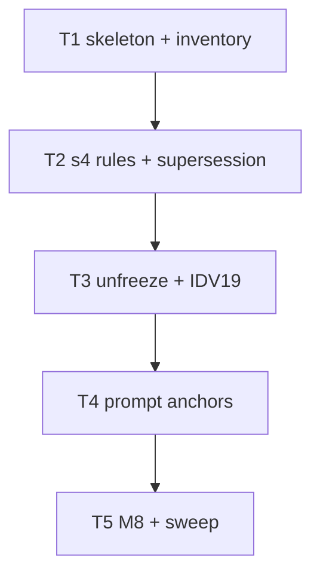

# Build plan: plan artifact skeleton (S2)

Upstream: `docs/specs/2026-08-14-plan-artifact-skeleton.md` rev 3 (approved
2026-08-14, spec panel converged over 2 rounds, 9/9 incorporated) and
`docs/plans/2026-08-14-plan-artifact-skeleton.md` rev 4 (plan panel converged,
3 rounds, 15/15). Track: **irreversible**. Branch:
`feat/plan-artifact-skeleton`.

All work is prose in `skills/sdlc/` (one new reference, one §4 edit with the
ratified clause supersession, one prompt edit), one inventory JSON row, one
docs amendment record, three test-file edits (S1 count pin, GPC2 pin, frozen
list + IDV19), and one new contract-test file. No script or schema changes.

## Decomposition rationale

Tasks are **contract-scoped with one shared test file**
(`test/plan-artifact-skeleton.test.js`, appended to incrementally — single
writer, serial chain), mirroring S1's shipped decomposition. C1–C8 own disjoint
production surfaces; no scenario is co-owned (PV1 Rule B needs a single owner).

Three merge decisions keep every task boundary **corpus-green**:

1. S1's M5 count amendment (81→82) folds into T1, the task whose inventory row
   breaks that pin.
2. The GPC2 pin update folds into T2, the task whose §4 clause swap breaks
   GPC2 (C8 edits 1+2 are one commit by contract).
3. **The unfreeze precedes the prompt edit** (T3 before T4 — the reverse of
   S1's written order). ASD19 diffs `base..HEAD` over the `FROZEN` list
   (`test/frozen-surfaces.test.js:46-50`), so a committed prompt edit while
   the prompt is still frozen is a red boundary; the entry must leave the list
   in an earlier or the same commit. Derivation call, recorded here.

## Dependency graph

## Tasks

Every task's Definition of Done includes the code-prose pass owned by
`references/phase-implement.md` §4, with the exact handoff
`Code-prose pass: complete`, placed before the task's validator/closure seam.

### T1 — Skeleton doc + inventory row (C1, C4)

- **Surfaces:** new `skills/sdlc/references/plan-artifact-skeleton.md`;
  `skills/sdlc/assets/normative-references.json`;
  `test/spec-artifact-skeleton.test.js` (the 81→82 count amendment, that one
  line only); new `test/plan-artifact-skeleton.test.js` (M1 + M5 assertions).
- **Does:** authors the skeleton with the exact shape C1 pins — H1, intro law
  (zero-state marker, guidance-not-prevention sentence), ten sections in fixed
  order, every literal marker/placeholder/table header, the five canonical
  rule sentences each inside its owning section, the sweep's five named
  minimum areas; no process citations anywhere in the shipped file. Adds C4's
  nine-field inventory row and amends S1's M5 pin to 82 in the same commit.
- **Scenarios owned:** PAS1, PAS6.
- **Checks:** `node --test test/plan-artifact-skeleton.test.js`
  (`scope: ["task"]`, offline, <1s); `npm test` (`scope: ["full"]`, offline,
  30s external timeout); `node skills/sdlc/scripts/check-references.mjs`
  (≤5s).

### T2 — §4 binding rules + ratified supersession (C2, C8)

- **Surfaces:** `skills/sdlc/references/phase-plan.md` (§4 only);
  `test/gate-presentation-contract.test.js` (the GPC2 pin line only);
  `docs/specs/2026-08-09-gate-presentation-contract.md` (the Amendments
  `None at rev 3.` line only); the contract test file (M2 appended).
- **Does:** inserts the binding-rules paragraph (five numbered canonical
  sentences, defect sentence, skeleton pointer) immediately after §4's first
  paragraph; swaps the provenance paragraph's closing clause to the
  62-character surviving rule; updates GPC2's pin to match (same commit —
  corpus-green); replaces the gate-presentation spec's `None at rev 3.` with
  the one-line full amendment record (trigger, class, disposition, author,
  in-place marker). Adds M2 (adjacency, `1.`–`5.` markers, defect sentence,
  pointer, following-paragraph order, clause swap both directions).
- **Scenarios owned:** PAS2, PAS3.
- **Checks:** `node --test test/plan-artifact-skeleton.test.js`
  (`scope: ["task"]`, offline, <1s);
  `node --test test/gate-presentation-contract.test.js` (offline, <1s);
  `npm test` (`scope: ["full"]`, offline, 30s external timeout).

### T3 — Unfreeze + IDV19 reconciliation (C5, C6)

- **Surfaces:** `test/frozen-surfaces.test.js` (the one FROZEN line only);
  `test/iteration-disposition.test.js` (IDV19 loop only); the contract test
  file (M6 + M7 window-scoped assertions appended).
- **Does:** removes the `adversary-plan.prompt.md` FROZEN entry leaving
  exactly L3's 16 entries in order; reconciles IDV19 to exempt `"plan"` only,
  with the AM1/AM3 comment placed **inside the IDV19 test body adjacent to the
  filtered loop** (never contiguous with the ownership comment block — IDV33's
  absorption, spec C6). Adds M6 (L3 equality with order) and M7 (IDV19
  exemption shape), both marked window-scoped for deletion at re-freeze.
- **Scenarios owned:** PAS7, PAS8.
- **Checks:** `node --test test/plan-artifact-skeleton.test.js`
  (`scope: ["task"]`, offline, <1s); `npm test` (`scope: ["full"]`, offline,
  30s external timeout).

### T4 — Prompt anchors (C3)

- **Surfaces:** `skills/sdlc/prompts/adversary-plan.prompt.md` (surfaces A–E
  only); the contract test file (M3 + M4 appended).
- **Does:** adds exactly one additive anchor sentence inside each of A, B, C,
  D, E per the pinned coverage map (A→Definition of done + `Carried to`;
  B→Problem statement + Outcome proof; C→Objectives and scope + Non-goals +
  Context for the next agent; D→Brainstorm provenance + Alternatives
  considered; E→NFR & repo-doc sweep + Pre-mortem), each citing
  `references/plan-artifact-skeleton.md`, restating no rule logic; F, the
  carry-landing paragraph, Delta rounds (L1), and the output format (L2) stay
  byte-stable. **No golden or fixture change** — the stamped goldens derive
  from the consumer override (spec assumption 2); `test/fixtures/` is
  untouched by this slice. Adds M3 (six letters, per-letter coverage map, L1/
  L2 byte-equality) and M4 (canonical sentences absent).
- **Scenarios owned:** PAS4, PAS5.
- **Checks:** `node --test test/plan-artifact-skeleton.test.js`
  (`scope: ["task"]`, offline, <1s); `npm test` (`scope: ["full"]`, offline,
  30s external timeout).

### T5 — M8 + verification sweep (C7 remainder)

- **Surfaces:** the contract test file (M8 appended); no production surfaces.
- **Does:** adds the M8 assertions (five literal denial substrings absent from
  the skeleton; guidance sentence present); runs the full verification sweep —
  whole corpus (PAS9's ASD19 runs inside it), check-references,
  check-lifecycle at this run's declaration, biome over touched surfaces.
- **Scenarios owned:** PAS9, PAS11, PAS12.
- **Checks:** `node --test test/plan-artifact-skeleton.test.js`
  (`scope: ["task"]`, offline, <1s); `node --test test/frozen-surfaces.test.js`
  (`scope: ["task"]`, offline, <1s — the standing ASD19 guard run standalone as
  PAS9's task-scoped evidence); `npm test` (`scope: ["full"]`, offline,
  30s external timeout); `node skills/sdlc/scripts/check-references.mjs`
  (≤5s); `bash skills/sdlc/scripts/check-lifecycle.sh --track irreversible
  --slug plan-artifact-skeleton` (≤5s); `npx biome check` over touched
  surfaces (≤5s).
- **Amendment (class b, 2026-08-14):** trigger — the PV1 runner rejected the
  first T5 manifest (Rule B: PAS9 cited only a `"full"`-tagged tests check);
  disposition — the standalone frozen-surfaces run added above as PAS9's
  `"task"`-tagged evidence; author — orchestrator. Approval renewed by this
  committed record.
- **Amendment (class b, 2026-08-15):** trigger — PR panel finding PR-R1-02
  (manifest `timeoutMs` kill-switches sat far above the governed per-check
  budgets, so the machinery did not enforce the bound it marked PASS);
  disposition — every check's `timeoutMs` across t1–t5 set to its committed
  budget (full corpus 30 s; each single-file test 1 s; reference, lifecycle,
  and lint checks 5 s each). The five committed receipts attest the
  pre-amendment runs; their runner reports show measured durations inside
  these budgets. Author — orchestrator. Approval renewed by this committed
  record.

## Scenario → task ownership

| Owner | Scenarios |
| --- | --- |
| T1 | PAS1, PAS6 |
| T2 | PAS2, PAS3 |
| T3 | PAS7, PAS8 |
| T4 | PAS4, PAS5 |
| T5 | PAS9, PAS11, PAS12 |
| PR panel (inspection) | PAS10, PAS13, PAS14 |
| Carried — post-merge, orchestrator-owned | PAS15 |

Every mechanical scenario has exactly one owning task. PAS15 is the mandatory
`track:none` re-freeze plus the #146 close-as-superseded closure, owned by the
orchestrator after merge (spec AM3); the obligation is recorded in the spec's
Amendments and must appear in the PR description (PAS14's inspection).

## Spec gap log

None. The spec was reviewed over two rounds (9 findings, 9 incorporated, 0
dismissed), minted no `CARRY-TO-BUILD`, and its contracts are implementable as
written; the mechanically-unverifiable claims (existing-paragraph
byte-intactness, the gate-presentation spec's amendment record, whole-slice
diff boundary) are deliberately routed to PR-gate inspection (PAS10) by
premise durability, not gaps.

## Assumptions

1. One new test file (`test/plan-artifact-skeleton.test.js`) is appended to
   incrementally by T1–T5 rather than one file per task — corpus stays flat,
   one writer, serial chain.
2. The unfreeze-before-prompt-edit order (T3→T4) is load-bearing: ASD19 diffs
   `base..HEAD` over the FROZEN list (`test/frozen-surfaces.test.js:46-50`),
   so the reverse order commits a frozen-file edit and turns that boundary
   red.
3. `npm test` is the `"full"`-scoped check for every task; the single-file run
   is the `"task"`-scoped check (PV1 Rules A and B).
4. Full-corpus task validators must not be dispatched in parallel — the
   S1-recorded flake (`check-references.test.js` cwd-sensitive spawn under
   concurrent `npm test`). Validators run serially.
5. `npx biome check .` is **clean on the branch base** (exit 0, verified at
   build time 2026-08-14) — S1's recorded base debt has since been retired, so
   task-scoped static checks carry no pre-existing-failure caveat.
6. T5's `check-lifecycle.sh --track irreversible --slug plan-artifact-skeleton`
   passes through the declaration; later artifact stages (PR, merge)
   legitimately fail until those events exist — a later-stage failure is
   expected, not a task failure (PAS11's note).
7. Exact prose wording inside the skeleton's fill-in guidance is the
   implementer's, constrained by C1's pinned shape, the canonical sentences
   quoted verbatim, and M8's denial set.
8. The gate-presentation spec's amendment record (C8 edit 3) is a docs-file
   prose edit pinned by no test; it rides T2 and is verified at the PR gate
   (PAS10), matching spec assumption 6.
9. (T1, Implement) Local full-corpus runs export the canonical macOS temp
   path (`TMPDIR=/private/var/...`): the default `/var` symlink alias defeats
   fixture root-containment checks (29 spurious failures); with the canonical
   path the corpus is 604/604 green, matching CI and the recorded receipts.

## Tracker

`shape.publishToTracker` is 2 and this breakdown has 5 tasks, so it publishes:
one epic plus five sub-issues on board 5, per `assets/tracker-ops.md`, serial
blocked-by chain (each task blocked by its predecessor).

Published 2026-08-14: epic **#248**; tasks **#249** (T1), **#250** (T2),
**#251** (T3), **#252** (T4), **#253** (T5); serial blocked-by chain
250←249, 251←250, 252←251, 253←252 (each task blocked by its predecessor).
