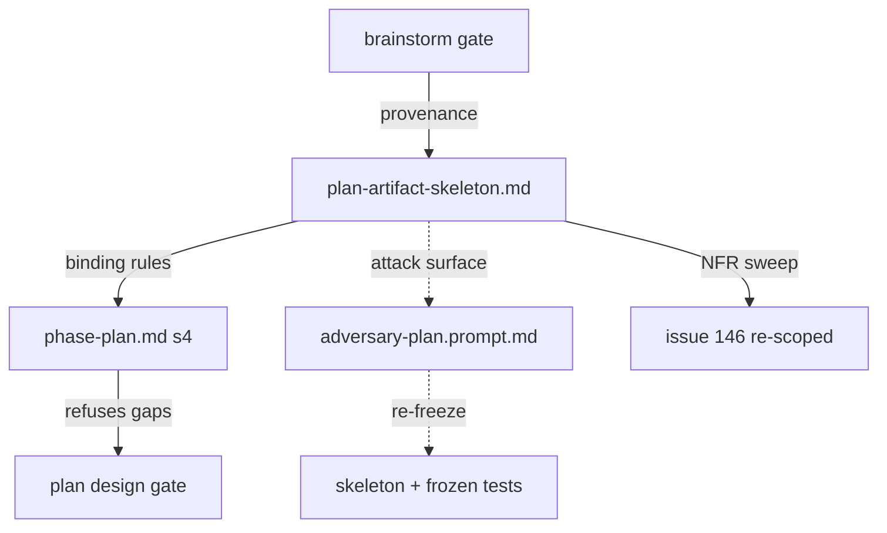

# Plan: Plan artifact skeleton (S2)

Status: rev 1 — draft; plan panel + owner approval pending

Track: irreversible — freezes the plan artifact shape (a public authoring surface adopted repos and later slices bind to)

Map: #192 (design-phase craft — decision-complete; S2 is the fifth ratified slice worked, order S5 → S1 → S3 → S4 → S2)

Run slug: `plan-artifact-skeleton`

## Brainstorm provenance

Plain mode — sketch and decisions list stored verbatim (gate passed 2026-08-14).

- appetite: one slice, one lifecycle session — prose + tests only; no new gate, dial, config field, or schema change (S1's scale)
- decision: reuse S1's shipped skeleton pattern — NEW `references/plan-artifact-skeleton.md` + `phase-plan.md` §4 authoring law (fill every block, delete no markers, declared zero-states, gate refuses gaps) — S1 kept the pattern deliberately generic for S2/S6 reuse
- decision: skeleton sections = R2-G1..G5 wrapped around §4's existing content — problem statement (actor/baseline/consequence, mechanism-free) · non-goals · alternatives incl. do-nothing · boundary labels with parked destinations · outcome-proof block · NFR & repo-doc sweep (applicability/target/binding/verification) · compact pre-mortem rows — provenance, objectives, DoD, next-agent context retained as slots
- decision: route R2-G7's outcome tree to S7 — ratified (owner, 2026-08-14); matches S1's shipped precedent for R3-G8, keeps all diagram/IA requirements in one slice
- decision: NFR sweep supersedes #146's bare checklist; #146 re-scoped on the tracker with a durable comment — ratified in R5 §3
- decision: `adversary-plan.prompt.md` gains a minimal skeleton-conformance surface → frozen-hash re-freeze, mirroring S1
- decision: sketch rendering guards for the brainstorm gate → follow-up #247, out of S2 scope — filed at owner direction
- rejected: touching `templates/sdlc-plan.md` — router stays thin; one authoritative home in references/
- rejected: a new mechanical linter/CI check for the sweep — slate kept new checks advisory-only; refusal stays agent-executed gate law
- rejected: folding the outcome tree into S2 — S7 owns comprehension surfaces; S2 stays exactly the slate's S2 row

## Objective

Give Plan authors the same fixed-skeleton treatment S1 gave Spec authors, closing the author/reviewer asymmetry at the plan gate. Concretely: introduce a plan-authoring skeleton (mechanism-free problem statement, non-goals, alternatives considered, boundary-labelled scope, outcome-proof block, NFR & repo-doc sweep, compact pre-mortem) as new reference guidance, state its binding rules in `references/phase-plan.md` §4, and teach the plan panel the same rules through anchors in the existing attack surfaces of `prompts/adversary-plan.prompt.md` — so a Plan that can pass today with a solution-shaped rationale, no falsifiable problem, no outcome measure, no NFR discovery, and no auditable risk becomes structurally incomplete at authoring time instead of at panel cost. The skeleton is authoring guidance, not mechanical prevention.

## Rationale

The plan reviewer prompt already demands what the authoring surface never asks for: its attack surfaces require falsifiable DoD items (A), verifiable outcomes (B), coherent scope boundaries (C), locked-decision fidelity (D), missing risks and dependencies (E), and track classification (F) — while `phase-plan.md` §4 asks the author only for "objectives, rationale, scope in/out, definition of done, context for the next agent, and the Brainstorm provenance block". This is the same author/reviewer asymmetry S1 closed at the spec gate, generalised to Plan exactly as the R5 synthesis observed ("R3's asymmetry finding generalises to Plan and Build").

The R2 brief (`docs/briefs/2026-07-26-design-phase-r2-plan.md`) is the authority for each gap and its adapted model, all owner-ratified via the R5 slate:

- **R2-G1** — a Plan can pass with no falsifiable actor, baseline, consequence, non-goals, or rejected alternative. Adapted from Google design-doc practice, Rust RFC 0000, Oxide RFD 1.
- **R2-G2** — design/spec detail can enter a Plan silently; no decision-boundary test says when detail is redesign or Spec work. Adapted from the Rust/Oxide problem-vs-design separation.
- **R2-G3** — a delivery DoD can prove files shipped while nothing shows the problem outcome moved. Adapted from GQM and Impact Mapping; an operational/adoption proxy or an explicit no-measurement rationale is legitimate for internal tooling.
- **R2-G4** — applicable quality attributes and operational/doc obligations (AGENTS/README, observability, secret delivery, CI/CD) may be omitted and can then never be bound or verified. Adapted from ISO/IEC 25010 read as a checklist-taxonomy, refining #146: Plan discovers and classifies, Spec binds, Build/Implement evidence, review verifies.
- **R2-G5** — risks lack required trigger, consequence, owner, mitigation, and destination, so risk review is not auditable. Adapted from Klein's pre-mortem as compact rows, not a project ritual.

The remaining R2 rows are owned elsewhere and stay out: G6 shipped with S5's iteration/disposition vocabulary, G7 routes to S7 (owner-ratified at this slice's gate, matching S1's routing of its diagram row), G8 routed to #158's build stream at R5.

## Scope

### In

1. **New `skills/sdlc/references/plan-artifact-skeleton.md`** — the authoring surface holding the literal fill-in skeleton, one section per block with markers, in artifact order:
   - **Brainstorm provenance** — a fixed slot for the block `phase-plan.md` §4 already requires (sketch + decisions list per the gate-presentation contract, or the explicit "no upstream gate" declaration). The skeleton gives it a home; §4 keeps the definition. No contract change.
   - **Problem statement** (G1) — actor/situation, observable baseline evidence, consequence of leaving it unsolved; prose is mechanism-free (no implementation prescription).
   - **Non-goals** (G1) — outcomes deliberately not pursued.
   - **Alternatives considered** (G1) — rejected alternatives including doing nothing, each with a trade-off reason; a justified `none` entry is legitimate.
   - **Objectives and scope with boundary labels** (G2) — every in-scope item carries exactly one label `objective` | `constraint` | `solution decision`; every parked item names its destination (Spec, Build, a tracker issue, or a backward transition).
   - **Outcome proof** (G3) — one row per objective: {goal, question, metric, baseline, target/window, evidence owner}; a proxy metric or a cited no-measurement rationale is an allowed fill, never a silent omission.
   - **Non-functional requirements & repo-doc sweep** (G4) — rows with columns {applicability + reason, target, binding phase, verification}; the sweep prompts cover at minimum the operational rows #146 named (AGENTS/README documentation, observability, security/secret delivery, CI/CD) plus ISO-25010-informed quality characteristics; `n/a` requires a technical reason. Plan discovers and classifies — exact thresholds and scenarios bind downstream.
   - **Pre-mortem** (G5) — compact rows {risk/failed future, trigger, consequence, mitigation, owner, destination}; small reversible work may declare the zero state instead.
   - **Definition of done** and **Context for the next agent** — retained as skeleton slots for §4's existing required content.
   - The S1 zero-state rule verbatim in spirit: fill every block, delete no markers; a block with legitimately zero entries keeps its header and carries `none — <one-line reason>`.
2. **`skills/sdlc/references/phase-plan.md` §4** — a short prose addition stating that Plans are authored against the fixed skeleton, listing the binding rules, and pointing to `references/plan-artifact-skeleton.md` as the pinned shape; the gate refuses a Plan with gaps. Draft binding rules:
   1. the problem statement names an actor, observable baseline evidence, and a consequence, and contains no implementation prescription;
   2. every in-scope item carries exactly one boundary label (`objective` | `constraint` | `solution decision`) and every parked item names its destination;
   3. every objective has an outcome-proof row — a metric with baseline and target/window and an evidence owner, or a cited proxy/no-measurement rationale;
   4. every NFR/repo-doc sweep row carries applicability, target, binding phase, and verification, or `n/a` with a technical reason;
   5. every pre-mortem row carries trigger, consequence, mitigation, owner, and destination, or the block declares its zero state.
3. **`skills/sdlc/prompts/adversary-plan.prompt.md`** — extend the existing lettered attack surfaces (A–F) with skeleton-awareness anchors naming the skeleton components as check targets and referencing `references/plan-artifact-skeleton.md` for their definitions. No new attack-surface letter, no output-contract change (the closed A–F CLEAR-line wording stays), no round-mechanics change (S5 territory). Rule definitions live only in the skeleton and §4 — the prompt references, never restates. The file is on the FS19 frozen list; it is unfrozen by removing it from the frozen array under the deliberate-change precedent (S5 → S1), and the unfreeze is recorded in the Amendments section of the spec this plan spawns.
4. **IDV19 reconciliation** — `test/iteration-disposition.test.js` (every adversary prompt stays frozen) temporarily exempts the deliberately-unfrozen plan prompt, restored by the re-freeze.
5. **Mandatory post-merge re-freeze** — the orchestrator (the session outliving the implementation agent's PR) files and executes a track-none follow-up immediately after merge re-adding `adversary-plan.prompt.md` to the frozen array and restoring IDV19's full assertion (precedent: S5 #206/#207, S1 #232). The implementing agent's duty ends at recording the obligation (spec Amendments + PR description); slice completion depends on the re-freeze merging.
6. **FS11 inventory row** — `reference.plan-artifact-skeleton` in `skills/sdlc/assets/normative-references.json` (checked by `check-references.mjs`).
7. **Contract tests** (`test/plan-artifact-skeleton.test.js`) — pure offline string assertions over markdown files, budget < 1 s, no network: `phase-plan.md` §4 carries the binding-rule text and the skeleton pointer; the skeleton carries the components as literal fill-in blocks; the prompt carries component anchors plus the skeleton-path reference and no restated rule definitions.
8. **Tracker supersession of #146** — after merge the orchestrator closes #146 as superseded with a durable comment: its sweep rows are absorbed as named prompts in the skeleton's sweep section; its "Build gate rejects blank sweeps" and linter mandates are deliberately not adopted (advisory-only ratification, R5). A tracker mutation, not a diff — rides no PR.

### Out

- R2-G6 (finding classes, delta rounds) — shipped with S5; no new prose here.
- R2-G7 (outcome/objective tree) and every diagram/IA-front-matter requirement — routed to S7, owner-ratified at this slice's brainstorm gate.
- R2-G8 (ceremony handoff payload) — routed to #158's build stream at R5.
- Any mechanical linter, CI check, or gate rejection for sweep completeness — enforcement is agent-executed gate law plus panel anchors, matching S1.
- Changing `templates/sdlc-plan.md` (stays a pure standalone-entrypoint router).
- Any change to the provenance contract itself (owned by the gate-presentation spec and §4's existing text), to CARRY-TO semantics or amendment classes (owned by S5's glossary), or to the re-round mechanics of the plan prompt.
- Consumer prompt overrides: enforcement is bounded to the package-default prompt; overrides resolve first by design and are consumer law. `test/fixtures/consumer/` stays untouched, full stop — a test failing on fixture content is a test-isolation defect to fix in the test, never a reason to touch the fixtures.
- Any new gate, dial, panel role, configuration value, schema change, or dependency.

## Assumptions

1. The skeleton lives under `references/` (authoring guidance) referenced from `phase-plan.md` §4, keeping the template a pure router — owner-ratified at the brainstorm gate.
2. S6 (Build craft) will reuse the same `references/<skeleton>.md` pattern; S2 keeps the shape generic. This is the second half of S1's assumption 2 — S2 itself is the first reuse, demonstrated by this slice; S6 remains future evidence.
3. The binding rules are prose law authored once in §4 (mirrored structurally in the skeleton), enforced by the plan panel through anchors in the prompt's existing lettered surfaces — not by a new mechanical checker. Contract tests prove the rules are present in the guidance and anchored in the prompt, not that any given Plan satisfies them.
4. Frozen-surface discipline: the changed authoring surfaces are `phase-plan.md` and the new skeleton; the deliberate `adversary-plan.prompt.md` unfreeze with paired IDV19 reconciliation, the inventory row, and the contract tests are the named permitted change classes; every other frozen script/prompt/schema stays byte-identical.
5. This Plan itself is authored under the shape it introduces as far as the current contract requires (provenance block verbatim, plain mode); full self-conformance to the new skeleton becomes checkable only after this slice ships and is not retro-imposed on this document.

## Definition of done

1. `skills/sdlc/references/plan-artifact-skeleton.md` exists and contains the skeleton components (provenance slot, problem statement, non-goals, alternatives considered, boundary-labelled objectives/scope, outcome proof, NFR & repo-doc sweep, pre-mortem, DoD + next-agent slots) as literal fill-in blocks with the zero-state rule.
2. `skills/sdlc/references/phase-plan.md` §4 states the five binding rules and points to the skeleton.
3. Contract tests assert: §4 carries the rule text and pointer; the skeleton carries the components as literal fill-in blocks; the prompt carries anchors naming the components plus the skeleton path and no restated rule definitions.
4. Each ratified gap is traceable to a non-empty skeleton component: G1 → problem statement + non-goals + alternatives, G2 → boundary labels, G3 → outcome proof, G4 → NFR & repo-doc sweep, G5 → pre-mortem.
5. All frozen surfaces are byte-identical to the branch base except the deliberate unfreeze of `adversary-plan.prompt.md` (removed from the frozen array; its only diff is skeleton-awareness within the existing lettered surfaces) and the paired temporary IDV19 reconciliation; both are restored by the mandatory post-merge re-freeze.
6. `templates/sdlc-plan.md` is unchanged.
7. Full test corpus passes (`npm test`, offline, under the 30-second external timeout); `biome check` over changed files is clean; `check-references.mjs` and the lifecycle checks pass.
8. No new dependency, public API, schema, dial, gate, or configuration change.
9. The orchestrator executes the track-none re-freeze immediately after merge and closes #146 as superseded with the durable comment; the slice is not complete until the re-freeze merges.

## Context for the next agent

- Primary authoring target: **new** `skills/sdlc/references/plan-artifact-skeleton.md`; edit `skills/sdlc/references/phase-plan.md` §4; extend the existing lettered attack surfaces in `skills/sdlc/prompts/adversary-plan.prompt.md`; add the `normative-references.json` row; unfreeze the prompt in `test/frozen-surfaces.test.js` with the paired IDV19 reconciliation in `test/iteration-disposition.test.js`; record all of it in the spec's Amendments plus the re-freeze obligation in the PR description. Your session ends at PR creation — do not attempt post-merge actions.
- The R2 brief is the authority for each gap's candidate change and done-means — read the G1/G2/G3/G4/G5 rows before writing. The R5 synthesis S2 row is the ratified scope.
- S1's shipped skeleton (`references/spec-artifact-skeleton.md`) and its `phase-spec.md` §4 block are the shape precedent — mirror their structure (intro law, per-section markers, binding-rule list) without copying spec-only content.
- Writing-comments discipline is sharper here than it was for S1's authors: the skeleton is a **shipped surface**, so it must carry no gap ids, slice names, issue numbers, or process citations — those live in this plan and the spec only. S1's shipped file is the clean example.
- The sweep section's exact row vocabulary (which ISO-25010 characteristics to prompt by name beyond #146's operational rows) is a Spec decision — this plan fixes the columns and the minimum row set, not the full row list.
- No carry is minted by this plan. The Specification must price all verification scenarios (workflow.md law) and the panel must verify the skeleton doesn't drift into a tooling or ceremony mandate.

## Amendments

None yet.
