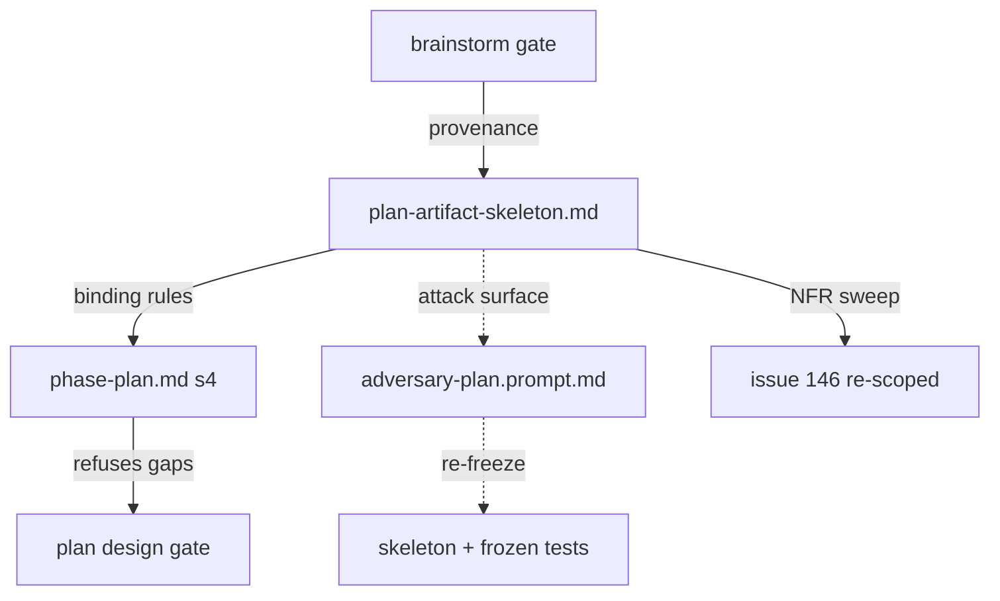

# Plan: Plan artifact skeleton (S2)

Status: rev 4 — plan-panel rounds 1–3 incorporated (15/15, 0 dismissed; glm round 3: PASS; adjudication in `docs/reviews/plan-review-plan-artifact-skeleton-2026-08-14/consolidated.md`); owner approval pending. Two escalations for the owner at the gate: the GPC clause supersession (including its spec-doc Amendments record) and the #146 disposition (see Amendments A1–A3).

Track: irreversible — freezes the plan artifact shape (a public authoring surface adopted repos and later slices bind to)

Map: #192 (design-phase craft — decision-complete; S2 is the fifth ratified slice worked, order S5 → S1 → S3 → S4 → S2)

Run slug: `plan-artifact-skeleton`

## Brainstorm provenance

Plain mode — sketch and decisions list stored verbatim (gate passed 2026-08-14).

- appetite: one slice, one lifecycle session — prose + tests only; no new gate, dial, config field, or schema change (S1's scale)
- decision: reuse S1's shipped skeleton pattern — NEW `references/plan-artifact-skeleton.md` + `phase-plan.md` §4 authoring law (fill every block, delete no markers, declared zero-states, gate refuses gaps) — S1 kept the pattern deliberately generic for S2/S6 reuse
- decision: skeleton sections = R2-G1..G5 wrapped around §4's existing content — problem statement (actor/baseline/consequence, mechanism-free) · non-goals · alternatives incl. do-nothing · boundary labels with parked destinations · outcome-proof block · NFR & repo-doc sweep (applicability/target/binding/verification) · compact pre-mortem rows — provenance, objectives, DoD, next-agent context retained as slots
- decision: route R2-G7's outcome tree to S7 — ratified (owner, 2026-08-14); matches S1's shipped precedent for R3-G8, keeps all diagram/IA requirements in one slice
- decision: NFR sweep supersedes #146's bare checklist; #146 re-scoped on the tracker with a durable comment — ratified in R5 §3
- decision: `adversary-plan.prompt.md` gains a minimal skeleton-conformance surface → frozen-hash re-freeze, mirroring S1
- decision: sketch rendering guards for the brainstorm gate → follow-up #247, out of S2 scope — filed at owner direction
- rejected: touching `templates/sdlc-plan.md` — router stays thin; one authoritative home in references/
- rejected: a new mechanical linter/CI check for the sweep — slate kept new checks advisory-only; refusal stays agent-executed gate law
- rejected: folding the outcome tree into S2 — S7 owns comprehension surfaces; S2 stays exactly the slate's S2 row

## Objective

Give Plan authors the same fixed-skeleton treatment S1 gave Spec authors, closing the author/reviewer asymmetry at the plan gate. Concretely: introduce a plan-authoring skeleton (mechanism-free problem statement, non-goals, alternatives considered, boundary-labelled scope, outcome-proof block, NFR & repo-doc sweep, compact pre-mortem) as new reference guidance, state its binding rules in `references/phase-plan.md` §4, and teach the plan panel the same rules through anchors in the existing attack surfaces of `prompts/adversary-plan.prompt.md`. The deliverable is structural: a Plan that today can pass with a solution-shaped rationale, no falsifiable problem, no outcome measure, no NFR discovery, and no auditable risk gains a fixed shape on which every such omission is nameable, findable, and refusable at the gate. The skeleton is authoring guidance, not mechanical prevention.

Outcome evidence (this plan's own outcome-proof discipline applied to itself): the intended movement — plan-gate defects caught at authoring time rather than panel cost — is observed by proxy as the round-1 finding mix of future `plan_review` panels on instrumented irreversible-track runs (harvested panel artifacts + FS13 telemetry), evidence owner: the sdlc-retro pass over those runs. No CI machinery observes this; it is a retro measurement, and S1's identical structural claim at the spec gate is the precedent.

## Rationale

The plan reviewer prompt already demands what the authoring surface never asks for: its attack surfaces require falsifiable DoD items (A), verifiable outcomes (B), coherent scope boundaries (C), locked-decision fidelity (D), missing risks and dependencies (E), and track classification (F) — while `phase-plan.md` §4 asks the author only for "objectives, rationale, scope in/out, definition of done, context for the next agent, and the Brainstorm provenance block". This is the same author/reviewer asymmetry S1 closed at the spec gate, generalised to Plan exactly as the R5 synthesis observed ("R3's asymmetry finding generalises to Plan and Build").

The R2 brief (`docs/briefs/2026-07-26-design-phase-r2-plan.md`) is the authority for each gap and its adapted model, all owner-ratified via the R5 slate:

- **R2-G1** — a Plan can pass with no falsifiable actor, baseline, consequence, non-goals, or rejected alternative. Adapted from Google design-doc practice, Rust RFC 0000, Oxide RFD 1.
- **R2-G2** — design/spec detail can enter a Plan silently; no decision-boundary test says when detail is redesign or Spec work. Adapted from the Rust/Oxide problem-vs-design separation.
- **R2-G3** — a delivery DoD can prove files shipped while nothing shows the problem outcome moved. Adapted from GQM and Impact Mapping; an operational/adoption proxy or an explicit no-measurement rationale is legitimate for internal tooling.
- **R2-G4** — applicable quality attributes and operational/doc obligations (AGENTS/README, observability, secret delivery, CI/CD) may be omitted and can then never be bound or verified. Adapted from ISO/IEC 25010 read as a checklist-taxonomy, refining #146: Plan discovers and classifies, Spec binds, Build/Implement evidence, review verifies.
- **R2-G5** — risks lack required trigger, consequence, owner, mitigation, and destination, so risk review is not auditable. Adapted from Klein's pre-mortem as compact rows, not a project ritual.

The remaining R2 rows are owned elsewhere and stay out: G6 shipped with S5's iteration/disposition vocabulary, G7 routes to S7 (owner-ratified at this slice's gate, matching S1's routing of its diagram row), G8 routed to #158's build stream at R5.

## Scope

### In

1. **New `skills/sdlc/references/plan-artifact-skeleton.md`** — the authoring surface holding the literal fill-in skeleton, one section per block with markers, in artifact order:
   - **Brainstorm provenance** — a fixed slot for the block `phase-plan.md` §4 already requires (sketch + decisions list per the gate-presentation contract, or the explicit "no upstream gate" declaration). The skeleton gives it a home; §4 keeps the definition. No contract change.
   - **Problem statement** (G1) — actor/situation, observable baseline evidence, consequence of leaving it unsolved; prose is mechanism-free (no implementation prescription).
   - **Non-goals** (G1) — outcomes deliberately not pursued.
   - **Alternatives considered** (G1) — rejected alternatives including doing nothing, each with a trade-off reason; a justified `none` entry is legitimate.
   - **Objectives and scope with boundary labels** (G2) — every in-scope item carries exactly one label `objective` | `constraint` | `solution decision`; every parked item names its destination (Spec, Build, a tracker issue, or a backward transition).
   - **Outcome proof** (G3) — one row per objective: {goal, question, metric, baseline, target/window, evidence owner, carried to}; a proxy metric or a cited no-measurement rationale is an allowed fill, never a silent omission; `carried to` names the metric's landing site (a Spec scenario/NFR binding or the retro) so a metric discovered at Plan cannot die at Plan.
   - **Non-functional requirements & repo-doc sweep** (G4) — rows with columns {applicability + reason, target, binding phase, verification}; the sweep prompts cover at minimum the operational rows #146 named (AGENTS/README documentation, observability, security/secret delivery, CI/CD) plus ISO-25010-informed quality characteristics; `n/a` requires a technical reason. Plan discovers and classifies — exact thresholds and scenarios bind downstream.
   - **Pre-mortem** (G5) — compact rows {risk/failed future, trigger, consequence, mitigation, owner, destination}; small reversible work may declare the zero state instead.
   - **Definition of done** and **Context for the next agent** — retained as skeleton slots for §4's existing required content.
   - The S1 zero-state rule verbatim in spirit: fill every block, delete no markers; a block with legitimately zero entries keeps its header and carries `none — <one-line reason>`.
2. **`skills/sdlc/references/phase-plan.md` §4** — a short prose addition stating that Plans are authored against the fixed skeleton, listing the binding rules, and pointing to `references/plan-artifact-skeleton.md` as the pinned shape; the gate refuses a Plan with gaps. Draft binding rules:
   1. the problem statement names an actor, observable baseline evidence, and a consequence, and contains no implementation prescription;
   2. every in-scope item carries exactly one boundary label (`objective` | `constraint` | `solution decision`) and every parked item names its destination;
   3. every objective has an outcome-proof row — a metric with baseline, target/window, and an evidence owner, or a cited proxy/no-measurement rationale — and the row names its Spec or retro landing site;
   4. every NFR/repo-doc sweep row carries applicability with its reason, target, binding phase, and verification, or `n/a` with a technical reason;
   5. every pre-mortem row carries trigger, consequence, mitigation, owner, and destination; only small reversible work may instead declare the block's zero state, with a one-line reason.
3. **`skills/sdlc/prompts/adversary-plan.prompt.md`** — extend the existing lettered attack surfaces (A–F) with skeleton-awareness anchors naming the skeleton components as check targets and referencing `references/plan-artifact-skeleton.md` for their definitions. No new attack-surface letter, no output-contract change (the closed A–F CLEAR-line wording stays), no round-mechanics change (S5 territory). Rule definitions live only in the skeleton and §4 — the prompt references, never restates. The file is on the FS19 frozen list; it is unfrozen by removing it from the frozen array under the deliberate-change precedent (S5 → S1), and the unfreeze is recorded in the Amendments section of the spec this plan spawns.

   This edit supersedes one shipped clause: `phase-plan.md` §4's provenance paragraph ends "…routes by reference to the frozen adversary plan prompt's attack surface D — the prompt itself stays untouched", and GPC2 (`test/gate-presentation-contract.test.js`) pins that literal plus §4's paragraph ordering. In scope: adjust that single clause to state the surviving rule (adjudication still routes by reference to attack surface D; the prompt is changed only under the FS19 deliberate-change precedent, and only with skeleton-awareness anchors) and update GPC2's pinned literal in the same commit, honouring its ordering pins on where §4 text sits and keeping the replacement pin under GPC10's 80-character verbatim-substring bound. The same supersession gets a one-line entry in the shipped gate-presentation spec's Amendments section (`docs/specs/2026-08-09-gate-presentation-contract.md` — its C2 shape restates the superseded clause), so the settled-decision record never contradicts the repo silently; that entry **replaces** the section's `None at rev 3.` line and is a full amendment record in one line — trigger, class, disposition, author — with an in-place marker naming this Plan (and its spawned spec) as the home of the full record. **Declared supersession of a settled decision — ratified by the owner at this plan's gate, never absorbed silently.**
4. **Stamped-agent goldens — unchanged by design.** The extraction suite stamps every phase against the consumer fixture config, and prompt resolution is consumer-override-first; that fixture ships its own plan prompt, so the golden derives from the override and the package-default prompt change leaves every golden and the extraction suite byte-identical. The package prompt's content coverage is the contract-test anchors (item 8) — the same mechanism S1 shipped, which touched no goldens. `test/fixtures/golden/` and `test/fixtures/consumer/` both stay untouched.
5. **IDV19 reconciliation** — `test/iteration-disposition.test.js` (every adversary prompt stays frozen) temporarily exempts the deliberately-unfrozen plan prompt, restored by the re-freeze.
6. **Mandatory post-merge re-freeze** — the orchestrator (the session outliving the implementation agent's PR) files and executes a track-none follow-up immediately after merge re-adding `adversary-plan.prompt.md` to the frozen array and restoring IDV19's full assertion (precedent: S5 #206/#207, S1 #232). The re-freeze also deletes the window-scoped guards of item 8 (S3 precedent: the window-scoped GPC11 tests deleted post-merge, #241). The implementing agent's duty ends at recording the obligation (spec Amendments + PR description); slice completion depends on the re-freeze merging.
7. **FS11 inventory row** — `reference.plan-artifact-skeleton` in `skills/sdlc/assets/normative-references.json` (checked by `check-references.mjs`), plus the paired amendment of S1's M5 exact-count pin (`test/spec-artifact-skeleton.test.js`, 81 → 82 source rows) — the pin is the design, amended deliberately by the slice that adds a row.
8. **Contract tests** (`test/plan-artifact-skeleton.test.js`) — pure offline string assertions over markdown files, budget < 1 s, no network: `phase-plan.md` §4 carries the binding-rule text and the skeleton pointer; the skeleton carries the components as literal fill-in blocks; the prompt carries component anchors plus the skeleton-path reference and no restated rule definitions. Additionally, **window-scoped unfreeze guards**, active only between merge and re-freeze: the exact post-unfreeze `FROZEN` membership is asserted (so no second surface can silently leave the frozen list during the window) and IDV19's exemption is pinned to exactly the one plan prompt; both guards are deleted by the re-freeze follow-up.
9. **Tracker supersession of #146** — after merge the orchestrator **closes #146 as superseded** with a durable comment: its sweep rows are absorbed as named prompts in the skeleton's sweep section; its "Build gate rejects blank sweeps" and linter mandates are deliberately not adopted (advisory-only ratification, R5). The close-as-superseded disposition concretises the gate's "re-scoped on the tracker" decision line and is **ratified by the owner at this plan's gate** (R5 §3 ratified only the shape supersession, not a tracker end-state). A tracker mutation, not a diff — rides no PR.

### Out

- R2-G6 (finding classes, delta rounds) — shipped with S5; no new prose here.
- R2-G7 (outcome/objective tree) and every diagram/IA-front-matter requirement — routed to S7, owner-ratified at this slice's brainstorm gate.
- R2-G8 (ceremony handoff payload) — routed to #158's build stream at R5.
- Any mechanical linter, CI check, or gate rejection for sweep completeness — enforcement is agent-executed gate law plus panel anchors, matching S1.
- Changing `templates/sdlc-plan.md` (stays a pure standalone-entrypoint router).
- Any change to the provenance contract's semantics — the block's content, storage modes, and adjudication routing via attack surface D stay exactly as shipped. The sole permitted touch on that shipped text is the single-clause supersession named in Scope item 3 (the "stays untouched" literal and its GPC2 pin). CARRY-TO semantics and amendment classes (owned by S5's glossary) and the re-round mechanics of the plan prompt stay out entirely.
- Consumer prompt overrides: enforcement is bounded to the package-default prompt; overrides resolve first by design and are consumer law. `test/fixtures/consumer/` stays untouched, full stop — a test failing on fixture content is a test-isolation defect to fix in the test, never a reason to touch the fixtures.
- Any new gate, dial, panel role, configuration value, schema change, or dependency.

## Assumptions

1. The skeleton lives under `references/` (authoring guidance) referenced from `phase-plan.md` §4, keeping the template a pure router — owner-ratified at the brainstorm gate.
2. S6 (Build craft) will reuse the same `references/<skeleton>.md` pattern; S2 keeps the shape generic. This is the second half of S1's assumption 2 — S2 itself is the first reuse, demonstrated by this slice; S6 remains future evidence.
3. The binding rules are prose law authored once in §4 (mirrored structurally in the skeleton), enforced by the plan panel through anchors in the prompt's existing lettered surfaces — not by a new mechanical checker. Contract tests prove the rules are present in the guidance and anchored in the prompt, not that any given Plan satisfies them.
4. Frozen-surface discipline: the changed authoring surfaces are `phase-plan.md` and the new skeleton; the named permitted change classes are the deliberate `adversary-plan.prompt.md` unfreeze with paired IDV19 reconciliation and window-scoped guards, the inventory row with its paired M5 count amendment, the contract tests, the GPC2 pin update, and the gate-presentation spec's C2 Amendments record; every other frozen script/prompt/schema stays byte-identical.
5. This Plan itself is authored under the shape it introduces as far as the current contract requires (provenance block verbatim, plain mode); full self-conformance to the new skeleton becomes checkable only after this slice ships and is not retro-imposed on this document.

## Definition of done

1. `skills/sdlc/references/plan-artifact-skeleton.md` exists and contains the skeleton components (provenance slot, problem statement, non-goals, alternatives considered, boundary-labelled objectives/scope, outcome proof with its `carried to` field, NFR & repo-doc sweep, pre-mortem, DoD + next-agent slots) as literal fill-in blocks with the zero-state rule.
2. `skills/sdlc/references/phase-plan.md` §4 states the five binding rules and points to the skeleton.
3. Contract tests assert: §4 carries the rule text and pointer; the skeleton carries the components as literal fill-in blocks; the prompt carries anchors naming the components plus the skeleton path and no restated rule definitions; and, window-scoped until the re-freeze, the exact post-unfreeze `FROZEN` membership and the one-prompt IDV19 exemption.
4. Each ratified gap is traceable to a non-empty skeleton component: G1 → problem statement + non-goals + alternatives, G2 → boundary labels, G3 → outcome proof, G4 → NFR & repo-doc sweep, G5 → pre-mortem.
5. All frozen surfaces are byte-identical to the branch base except the deliberate unfreeze of `adversary-plan.prompt.md` (removed from the frozen array; its only diff is skeleton-awareness within the existing lettered surfaces) and the paired temporary IDV19 reconciliation; both are restored by the mandatory post-merge re-freeze, which also deletes the window-scoped guards.
6. `test/fixtures/golden/` and `test/fixtures/consumer/` are byte-identical to the branch base and the extraction suite passes unmodified (the golden derives from the consumer override, so the package-prompt change cannot move it); `test/spec-artifact-skeleton.test.js`'s M5 count is amended 81 → 82 and every other M-assertion passes unmodified.
7. The single-clause §4 supersession lands with its paired GPC2 literal update in the same commit, the replacement pin staying under GPC10's 80-character bound; every other GPC pin (literals and §4 ordering) passes unmodified; the gate-presentation spec's Amendments section records the C2 clause supersession as a one-line full amendment record (trigger, class, disposition, author, in-place marker) replacing its `None at rev 3.` line.
8. `templates/sdlc-plan.md` is unchanged.
9. Verification budgets, each externally bounded: new contract tests < 1 s offline; `npm test` under the 30-second external timeout; `npx biome check` over changed JS files ≤ 5 s; `node skills/sdlc/scripts/check-references.mjs` ≤ 5 s; `bash skills/sdlc/scripts/check-lifecycle.sh --track irreversible --slug plan-artifact-skeleton` ≤ 5 s once Spec and Build artifacts are committed. All pass.
10. No new dependency, public API, schema, dial, gate, or configuration change.
11. The orchestrator executes the track-none re-freeze immediately after merge and closes #146 as superseded with the durable comment; the slice is not complete until the re-freeze merges.

## Context for the next agent

- Primary authoring target: **new** `skills/sdlc/references/plan-artifact-skeleton.md`; edit `skills/sdlc/references/phase-plan.md` §4 (binding rules + the ratified single-clause supersession, honouring GPC2's ordering pins with the paired literal update in `test/gate-presentation-contract.test.js`, replacement pin under GPC10's 80-character bound); add the one-line C2-supersession entry to the gate-presentation spec's Amendments; extend the existing lettered attack surfaces in `skills/sdlc/prompts/adversary-plan.prompt.md` — do NOT touch `test/fixtures/golden/` or `test/fixtures/consumer/` (the golden derives from the consumer override; your prompt coverage is the contract-test anchors); add the `normative-references.json` row and amend M5's count (81 → 82) in `test/spec-artifact-skeleton.test.js`; unfreeze the prompt in `test/frozen-surfaces.test.js` with the paired IDV19 reconciliation in `test/iteration-disposition.test.js` and add the window-scoped guards; record all of it in the spec's Amendments plus the re-freeze obligation in the PR description. Your session ends at PR creation — do not attempt post-merge actions.
- The R2 brief is the authority for each gap's candidate change and done-means — read the G1/G2/G3/G4/G5 rows before writing. The R5 synthesis S2 row is the ratified scope.
- S1's shipped skeleton (`references/spec-artifact-skeleton.md`) and its `phase-spec.md` §4 block are the shape precedent — mirror their structure (intro law, per-section markers, binding-rule list) without copying spec-only content.
- Writing-comments discipline is sharper here than it was for S1's authors: the skeleton is a **shipped surface**, so it must carry no gap ids, slice names, issue numbers, or process citations — those live in this plan and the spec only. S1's shipped file is the clean example.
- The sweep section's exact row vocabulary (which ISO-25010 characteristics to prompt by name beyond #146's operational rows) is a Spec decision — this plan fixes the columns and the minimum row set, not the full row list.
- No carry is minted by this plan. The Specification must price all verification scenarios (workflow.md law) and the panel must verify the skeleton doesn't drift into a tooling or ceremony mandate.

## Amendments

### A1 — plan rev 2: incorporate plan-panel round 1

- Trigger: plan-panel round 1 (gpt-5.6-luna:xhigh + zai/glm-5.2:xhigh; gemini-3.1-pro-preview infra-failed on a 429 credit depletion pre-verdict and was replaced by glm-5.2 per the recovery rule) returned 3 high / 7 medium after dedupe; all 10 incorporated, none dismissed.
- Class: **(c), normal fix wave**.
- Disposition: **incorporated** — see `docs/reviews/plan-review-plan-artifact-skeleton-2026-08-14/consolidated.md`. Substantive changes: stamped-agent golden regeneration and the M5 inventory-count amendment join the named change classes; window-scoped unfreeze guards (exact FROZEN membership + pinned IDV19 exemption) added, deleted by the re-freeze; the shipped "prompt itself stays untouched" clause is superseded in a single-clause §4 edit with its GPC2 pin updated — **escalated for owner ratification at the gate**; #146's end-state unified as close-as-superseded and attributed to this gate, not R5 §3 — **escalated for owner ratification at the gate**; outcome-proof row gains `carried to`; binding rules 3/4/5 tightened (landing site; applicability reason; zero state conditional on small reversible work); objective recast structurally with a retro-owned proxy outcome measure; per-check verification budgets added.
- Author: orchestrator (`anthropic/claude-fable-5`), during plan-panel adjudication on 2026-08-14.

### A2 — plan rev 3: incorporate plan-panel round 2

- Trigger: round-2 delta review (gpt-5.6-luna:xhigh + zai/glm-5.2:xhigh) confirmed all ten rev-2 fixes and raised three findings after dedupe (1 high / 1 medium / 1 low); all 3 incorporated, none dismissed.
- Class: **(c), normal fix wave**.
- Disposition: **incorporated** — see `docs/reviews/plan-review-plan-artifact-skeleton-2026-08-14/consolidated.md` (round 2). PLAN-R2-01: the round-1 golden-regeneration class rested on a false premise — the golden is stamped from the consumer override (FS5 consumer-override-first), so the package-prompt change cannot move it; the class is replaced by an explicit goldens-unchanged-by-design declaration with package-prompt coverage via the contract-test anchors (S1's shipped precedent — no goldens touched). The alternative fix (a second, package-default golden pipeline) was rejected in adjudication as redundant CI machinery. PLAN-R2-02: the shipped gate-presentation spec's C2 shape restates the superseded clause — a one-line Amendments entry there joins the named change classes so the settled-decision record cannot silently contradict the repo. PLAN-R2-03: the replacement GPC2 pin is bounded by GPC10's 80-character verbatim-substring rule.
- Author: orchestrator (`anthropic/claude-fable-5`), during plan-panel adjudication on 2026-08-14.

### A3 — plan rev 4: incorporate plan-panel round 3

- Trigger: round-3 delta review — glm PASSed with one low finding after end-to-end re-verification of every round-2 fix; luna confirmed all thirteen priors and raised one medium; 2 findings, both incorporated, none dismissed. Falling severity and zero reopens: convergence — adjudicated to proceed to the gate rather than dispatch a fourth round over two sentence-level fixes.
- Class: **(c), normal fix wave**.
- Disposition: **incorporated** — see `docs/reviews/plan-review-plan-artifact-skeleton-2026-08-14/consolidated.md` (round 3). PLAN-R3-01: the C2 Amendments entry is specified as a full one-line amendment record (trigger, class, disposition, author, in-place marker) replacing the `None at rev 3.` line — the alternative of a backward Spec gate for a one-clause historical record was rejected as disproportionate given the supersession is owner-ratified at this gate. PLAN-R3-02: Assumption 4's change-class enumeration extended to match Scope (GPC2 pin, M5 amendment, spec Amendments record).
- Author: orchestrator (`anthropic/claude-fable-5`), during plan-panel adjudication on 2026-08-14.
