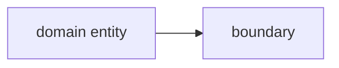

# Phase reference: Brainstorm

> Detailed public contract for the Brainstorm phase. `SKILL.md` owns the kernel,
> the readiness gate, and the phase sequence; this reference owns Brainstorm's
> mechanics. Paths are skill-relative. Every configuration-dependent branch is an
> explicit **under your configuration** callout routed to the effective shape
> (current `.pi/sdlc/CONFIG.md`, or authoritative `sdlc.config.json` when the
> companion is absent or stale) — never a silently assumed value.

## 1. Purpose and invocation modes

Brainstorm turns an idea into an agreed design. It runs two ways:

- **Full lifecycle:** the first phase, entered after `sdlc-status` reports ready.
- **Standalone entrypoint `sdlc:brainstorm`** (`templates/sdlc-brainstorm.md`):
  a directly invocable dialogue. It needs no committed upstream; unadopted it
  runs as plain dialogue, adopted it runs as the configured gate.

Brainstorm is a live dialogue, not a drafting exercise the agent completes
alone. The agent's job is to be the author's thinking companion: actively
rubber-duck the idea, not agree with it. Going along with whatever the human
says first is a failure mode, not politeness. This applies to both plain
dialogue and map mode below — it is how the conversation runs, not a mode of
its own.

Concrete behaviour, not just tone:

The dialogue runs on named moves — greppable, not scripted: **G1 open on
problem and outcome, naming no mechanism** (the opening asks what is broken
or wanted, never how to build it); **G2 alternative-or-declare** (for each
design choice, name a live alternative or declare there is none); **G3
appetite before converging** (elicit scale, time, and effort before the
design converges — the same appetite that later opens the decisions list at
the gate). Moves G4 and G7 are the two labelled bullets below.

- **Raise a contradiction, or say there isn't one.** Before the gate, name at
  least one contradiction, unstated assumption, or gap in the design if one
  exists. If the design is genuinely clean, state that explicitly ("no
  contradiction found") rather than saying nothing — silence is not evidence of
  soundness.
- **Use the tools available** (move G4 — research-or-declare), not just the
  conversation, when they would actually sharpen the thinking: web research
  for prior art or external grounding, and codebase exploration when the idea
  touches an existing pattern the human might be unaware of or wrongly
  assuming is novel. Research is required only when one of exactly three
  triggers fires: an **external dependency** the design leans on, a
  **prior-art claim** it rests on, or a **cross-repo pattern invoked** by the
  idea; outside those triggers there is no research ceremony. This is
  proportional, not mandatory ceremony — a brief brainstorm does not need a
  research pass just to be brief. A fired-but-skipped trigger must be
  declared in the same gate presentation — skipping is visible, never silent.
- **Ask about constraints once** (move G7 — constraints prompt). One prompt,
  not a battery: ask the human to name the constraints that shape the design,
  or declare `none identified` — a complete answer, not a failure state.
  Named constraints inform the design and become decision lines only when
  they actually bind; Brainstorm never binds a constraint itself.
- **Present open questions per the shared contract**
  (`references/system-reference.md`, "Presenting questions to the human") —
  never a wall of unstructured prose. Brainstorm's delta: a recommendation
  must **widen the option space, not steer it** — recommend freely on
  mechanical questions (where something should live), sparingly on design
  direction (what something should be). Assumptions stated in dialogue need
  no ledger here: Brainstorm commits no artifact, and the Plan restates every
  assumption that survives.
- **Expand and pressure-test, don't commandeer.** Contradictions and questions
  exist to widen the human's option space, not to steer the design toward the
  agent's own preferred answer. The human remains the owner of the direction;
  the gate is *their* approval, not the agent's conviction.

## 2. Entry conditions and authoritative upstream inputs

No committed upstream artifact is required — Brainstorm forms intent live. Its
authoritative inputs are the human's stated goal and any existing code, docs, or
prior-art the dialogue chooses to ground against.

## 3. Configured before-hook order and blocking semantics

If the effective config declares `hooks.brainstorm.before` (and/or `hooks."*"`),
fire them first. **Before** hooks fire `*` items first, then phase-specific; a
failed or skipped `before` hook **blocks** the phase. See
`references/system-reference.md`, "Hooks", for the full hook contract, ordering,
failure semantics, and the announce-on-fire audit trail.

> **Under your configuration:** the hooks that actually fire are whatever
> `.pi/sdlc/sdlc.config.json` declares for `brainstorm`/`*`. Do not assume any
> repo has brainstorm hooks.

## 4. Required activity and artifact/output shape

The activity is the dialogue itself. Plain brainstorm produces **no committed
artifact** — the agreed design is carried forward into the Plan. Map mode (§9)
produces a GitHub map issue as its canonical, resumable record.

## 5. Invariant gate/approval seam

The invariant seam is **human approval of the agreed design**. The gate is the
human owner's, not the agent's.

> **Under your configuration:** `review.brainstorm` is `human` or `off`. Read the
> effective value from current `CONFIG.md` (or authoritative `sdlc.config.json`).
> When `off`, there is no explicit brainstorm gate, but the design must still be
> agreed before Plan begins; never assume a fixed gate mode.

## 6. Refusal and backward-transition behaviour

Brainstorm refuses nothing on upstream grounds (there is no upstream). Backward
transition into Brainstorm from any later phase is always allowed and never
penalised when a later phase exposes a design flaw — the sunk cost of a later
gate never justifies shipping a known-wrong design.

## 7. After-hook order and warning semantics

If `hooks.brainstorm.after` (and/or `hooks."*"`) are declared, fire them after
the gate: phase-specific first, then `*`. A failed `after` hook **warns**
(recorded, never blocking). Full semantics in `references/system-reference.md`,
"Hooks".

## 8. Completion evidence and next transition

Completion evidence is the human-approved design (plain mode) or a
decision-ready map destination (map mode). Both land at the gate as **The gate
presentation** — exactly two artifacts, and nothing else:

1. **The sketch** — a mermaid picture of the design: entities, boundaries,
   flows, actors. It is required when the design adds a new flow or three or
   more interacting components; otherwise its absence is declared at the gate,
   never silent. The sketch is framing, not contractual — it captures how the
   change is thought about, and it is throw-away once the gate passes.
2. **The decisions list** — one line per crystallized decision, in exactly
   three line kinds:

````text


- appetite: <scale/time/effort>
- decision: <what was ratified> — <one-line why>
- rejected: <alternative refused> — <trade-off reason>
````

Rules for the list: exactly one `appetite:` line and it is the first decision
line — it binds ceremony (scale, time, effort), not shape. Every entry of all
three kinds is one physical line. `decision:` lines carry the ratified
decision with a one-line why. `rejected:` lines are unconditional — a refused
alternative is an explicit decision not to do something, and its trade-off
reason is always recorded; no ADR-criteria gate applies to crystallizing a
rejection.

A decision or rejection meeting the Governance bar in
`references/system-reference.md` additionally earns an ADR as a deep record in
either mode; qualifying decisions take the suffix — the literal ASCII
`(-> ADR 00NN)` appended to their line. The bar itself lives in that
paragraph; this block never restates it.

The gate is amended by talking: the human speaks, the agent updates the list,
and the amended list lands. No third contractual artifact and no prose recap
belongs at this gate — the framing dies with the whiteboard.

### Spike exit loop

When a load-bearing uncertainty would make the gate premature, use this ordered
guide and stop at the first matching route:

1. **Read now.** Use existing evidence only when it is sufficient to settle the
   uncertainty; evidence that is available but insufficient does not select this
   route. Issue #147 is the future mechanisation of this read tier. This guidance
   does not implement its feasibility linter.
2. **Plan and front-load.** When answering requires detailed requirements,
   delivery acceptance, or production behaviour, the work is delivery-grade:
   route to Plan and make the risk explicit there.
3. **Use human judgment.** When no empirical evidence can settle the question,
   ask the human to decide rather than disguising preference as investigation.
4. **Propose a spike.** Use a spike for the remaining empirical uncertainty.
   Incomplete goals or exit criteria stay in Brainstorm; they do not create a
   fifth route or authorize exploratory work.

A spike is an information-buying Brainstorm activity. Before work starts, a
human checkpoint approves one or more goals, the uncertainty each goal
addresses, and exit criteria. There is no mandatory numerical time or cost
threshold. Exit criteria that require detailed solution requirements or
delivery acceptance reveal a deliverable in disguise and route to Plan.

If the criteria are inadequately met, or the work reveals a new uncertainty, a
fresh human checkpoint must approve amended goals and exit criteria before
continuing, redirecting, selecting a direction, or transitioning to Plan. Exit
interpretation starts only after the current exit criteria are adequately met.

Interpret the exit on two independent axes:

- Direction is exactly **stop**, **revise**, or **proceed**: stop closes the
  proposed change without delivery; revise returns to Brainstorm; proceed may
  advance only through the normal Brainstorm gate.
- Artifact treatment is selected independently from direction: **discard**,
  **retain as reference**, **provisional foundation**, or **provisional
  candidate deliverable**. For either provisional treatment, the decision names
  the future or proceeding effort it serves; without that destination, the
  treatment reduces to reference or discard. Reuse is never mandatory, and a
  foundation or candidate remains provisional until downstream lifecycle
  contracts pass.

Retained spike evidence may be a document, issue comment, prototype branch, or
artifact directory. Link it from an existing `decision:` line that summarizes
the learning, direction, and artifact treatment and remains meaningful if the
link is later removed. No mandatory storage hierarchy or fourth decision-line
kind is introduced. This starts as a qualitative corpus of decision lines and
links; it adds no new FS13 event vocabulary.

For **proceed**, the normal gate still controls progression. The next transition
is **Plan**, and the Plan carries the provenance: the sketch embeds verbatim,
and the decisions list crosses as the store (plain mode) or the index (map mode)
per the Plan phase's storage rule.

## 9. Advanced-mode pointers — map mode (wayfinder-lite)

Default brainstorm is a single dialogue gated by human approval, sized for one
session. Switch to **map mode** when the idea is too large or too foggy for
that: the destination — what reaching the end of this effort's brainstorming
looks like, usually a Plan-ready decision — is not visible yet, and forcing it
into one dialogue would either truncate the thinking or blow the session's
context.

**The map** is a GitHub issue labeled `<LABEL_PREFIX>:map` — the canonical,
resumable artifact for the effort, not a doc. Its body carries: **Destination**
(what reaching the end of this map looks like, one or two lines), **Notes**
(skills to consult, standing preferences), **Decisions so far** (one line per
closed ticket, gisted, linking the ticket for detail), and **Not yet specified**
(the fog — see below). Never restate a ticket's detail on the map; the map is an
index, the ticket is the store.

**Tickets** are native GitHub sub-issues of the map, each typed by label
(`<LABEL_PREFIX>:ticket-research` | `-prototype` | `-grilling` | `-task` — see
`assets/tracker-ops.md` for the label vocabulary and every mutation). Every
ticket is either **HITL** (worked with a live human — it only resolves through
that real exchange; an agent answering its own grilling questions has broken
this) or **AFK** (agent alone), marked explicitly with the `<LABEL_PREFIX>:hitl`
/ `<LABEL_PREFIX>:afk` label alongside its ticket-type label. A session
**claims** a ticket by assigning it to itself before starting work
(`assets/tracker-ops.md`, "Claim by assignment"). Blocking uses the native
`blockedBy` edge so the **frontier** — open, unblocked, unclaimed tickets — is
visible without reopening a conversation.

**Fog of war.** Don't ticket what you can't yet phrase precisely. The test is
whether the question is sharp now, not whether you can answer it now: ticket when
it is already sharp (even if blocked); leave it in **Not yet specified** when you
can't yet phrase it that sharply — write it as loosely as the view allows. A
**parked** question (the shared contract's tier) is fog by another name: in map
mode it lands in Not yet specified rather than a separate ledger, graduating to
a ticket once sharp.
Resolving a ticket clears the fog ahead of it, graduating whatever is now
specifiable into fresh tickets, one at a time.

**Out of scope.** Work beyond the destination is not fog — it is out of scope,
its own map section, never graduating. If a ticket turns out to sit past the
destination, close it and record one line (gist + why) in Out of scope rather
than resolving it on the route.

**Working the map** (never resolve more than one ticket per session): load the
map's low-res body (not every ticket); choose the ticket (the user's choice, or
the first frontier ticket); claim it; resolve it, invoking whatever the ticket
type and `## Notes` call for; record the resolution as a comment, close the
ticket, and append one line to Decisions so far; graduate any fog the answer
specifies into fresh tickets, and rule out of scope anything the answer reveals
is past the destination.

**Exit** the moment the destination is decision-ready — often before every fog
patch has graduated. At that point proceed to Plan normally, using the
destination as its objective. If breadth-first mapping surfaces no fog at all —
the whole effort fits in one session — skip the map and use plain brainstorm
dialogue instead.

**Provenance at the gate.** When a map-sourced run reaches the Brainstorm
gate, the gate presentation crosses into the Plan under a split. **The
sketch embeds verbatim in the plan in both modes** — it is a gate artifact,
belonging to no ticket. Only **the decisions list becomes the index**: one
gist line + named link per ticket, and the full list kept verbatim in
exactly one home — never duplicated into the plan. The home is the
**resolution comment** carrying the full three-kind grammar: the decision
ticket's resolution comment, or — thread variant, only when the decisions
were ratified as thread comments on the map issue — a comment in the map
thread; entries sharing that comment share one home. Boundary rule for the
index lines: no line-kind prefix and no uniform classification of any kind;
kind names may appear as subject matter of the decision being gisted, and
entry classification lives only at the home.

Map-mode mechanics (labels, sub-issue/blocking mutations, board discipline) are
owned once by `assets/tracker-ops.md`.
